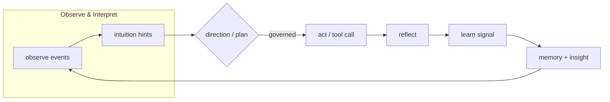

[](https://github.com/saraeloop/noesis/actions/workflows/pr-contracts.yml)
[](https://github.com/saraeloop/noesis/stargazers)
[](https://deepwiki.com/saraeloop/noesis)
[](#core-concepts)
[](pyproject.toml)
[](LICENSE)

# Noesīs (νόησις)

_Understanding, made observable._

Noesis is a cognitive runtime for agent workflows. It turns each run into an auditable episode with append-only artifacts, governed side effects, and resumable execution.

Bring your own graphs, loops, tools, and prompts. Noesis adds runtime evidence, verification, and governance boundaries without replacing your orchestrator or agent framework.

## Runtime boundary


## The problem

Modern agent frameworks can call tools, loop autonomously, update files, send requests, and make decisions across many steps. When something goes wrong, teams often do not have a clean, durable record of what actually happened.

An agent fails halfway through a task.
A tool call mutates the wrong file.
A side effect is vetoed.
A run succeeds, but nobody can explain why.

Most teams end up with some combination of:

- framework-specific traces
- ad hoc logs
- prompt dumps
- custom wrappers around side effects
- manual reconstruction after failures

That creates two bad options:

1. Trust the agent framework's internal state.
2. Build your own cognition, replay, and governance layer from scratch.

There is rarely a clean way to answer:

- What did the agent observe before it acted?
- How did the plan change over time?
- Why was an action allowed, audited, or blocked?
- What artifacts belong to this run?
- Can this run be inspected, verified, or continued later?

## What Noesis records

Noesis wraps an agent run and turns it into a structured episode.

For each run, it records explicit cognition phases:

**Observe -> Interpret -> Plan -> Govern -> Act -> Reflect -> Learn**

It then emits immutable artifacts such as:

- `events.jsonl` - timeline of the run with causal IDs
- `summary.json` - outcome, metrics, and cross-links
- `state.json` - current plan and episode state
- `final.json` - terminal sealing record for completed runs
- `manifest.json` - SHA-256 + size ledger for tamper evidence
- `learn.jsonl` - optional learning payloads
- `prompts.jsonl` - optional prompt provenance captured by the runtime when enabled

This gives you:

- **observable cognition** - inspect how the run evolved
- **durable artifacts** - keep a stable, append-only record of execution
- **governance boundaries** - review, audit, or veto side effects
- **verification** - prove which files belong to the episode and whether they changed
- **framework independence** - layer Noesis over LangGraph, CrewAI, or custom graphs

## Minimal example

```python
import noesis as ns

episode_id = ns.run("Draft a weekly engineering update", intuition=True)

summary = ns.summary.read(episode_id)
timeline = list(ns.events.read(episode_id))

print(summary["metrics"]["success"])
print(timeline[0]["phase"], timeline[0].get("payload"))
```

## Artifact layout

By default, Noesis writes artifacts under `.noesis/episodes/`:

```text
.noesis/
  episodes/
    ep_.../
      events.jsonl
      summary.json
      state.json
      final.json
      manifest.json
      learn.jsonl     # optional
      prompts.jsonl   # optional
```

Each episode becomes a durable record you can inspect, verify, and use for debugging, evaluation, and audits.

## Flow at a glance



## Core concepts

### Episode model

Each run is an episode with a stable ID, structured event timeline, and artifact pack.

### Governance boundary

Side effects can flow through a governed boundary so actions are recorded, reviewed, audited, or vetoed before execution.

### Pause, checkpoint, and continue

Noesis supports interruption, checkpointing, and continuation on the same run.

### Verification

Workspace verification uses pre/post snapshots plus explicit assertions such as `file_exists(...)`, `file_contains(...)`, and `only_modified(...)`.

### Framework-agnostic integration

Noesis does not replace your agent framework. It layers runtime evidence, cognition phases, and governance over the workflows you already have.

## Quickstart

Python >= 3.11. Source-first.

```bash
git clone https://github.com/saraeloop/noesis.git
cd noesis
uv tool install .
# or: pipx install .
```

Optional for pretty JSON in CLI examples:

```bash
brew install jq
```

Run the demo:

```bash
uv run python examples/demo.py
```

## Bring your own agent / graph

Noesis is framework-agnostic. Keep your prompts, tools, and orchestration logic:

```python
from pathlib import Path
import noesis as ns

episode_id = ns.solve(
    "Generate release notes from ./CHANGELOG.md",
    using=lambda: Path("flows/release_notes.py"),
    intuition=True,
)
```

## Governed side effects

Noesis can govern side effects through `ns.governed_act(...)`.

This lets you record and gate operations such as:

- shell execution
- file mutations
- other effectful operations routed through your runtime boundary

```python
import noesis as ns
from noesis.exceptions import NoesisVeto


def run_shell(*, command: str, cwd: str | None = None, timeout_ms: int | None = None):
    return {"stdout": "ok", "stderr": "", "exit_code": 0, "command": command}


ns.set(shell_executor=run_shell)

try:
    result = ns.governed_act(
        goal="List repository files",
        kind="shell",
        payload={
            "command": "ls -a",
            "cwd": ".",
            "timeout_ms": 2000,
        },
    )
    print(result)
except NoesisVeto as veto:
    print(f"Blocked by governance: {veto.advice}")
```

## Workspace verification

Noesis can verify real filesystem effects with pre/post workspace snapshots:

```python
import noesis as ns

verify = [
    ns.file_exists("config.yaml"),
    ns.file_contains("config.yaml", "enabled: true"),
    ns.only_modified(["config.yaml"]),
]

episode_id = ns.solve(
    "Update config",
    using="my.module:adapter_fn",
    workspace=".",
    verify=verify,
)
```

## Pause, checkpoint, and continue

Noesis supports interruption, checkpointing, and continuation on the same run:

```python
import noesis as ns

ns.set(governance_mode="enforce", governance_pause_on_veto=True)

episode_id = ns.solve("Danger operation: delete production database", using=my_graph)

interrupt_id = ns.interrupt(episode_id, reason="awaiting approval")
checkpoint = ns.checkpoint(episode_id, caused_by=interrupt_id)

ns.resume(episode_id, checkpoint_id=checkpoint["checkpoint_id"])

episode_id = ns.resume_run(
    episode_id,
    checkpoint_id=checkpoint["checkpoint_id"],
    using=my_graph,
)
```

Rule of thumb:

- `resume()` emits lifecycle evidence only
- `resume_run()` emits `run.resume` and continues execution

## Troubleshooting and common pitfalls

- **`governed_act` executor not configured**: before `ns.governed_act(..., kind="shell", ...)`, register an executor with `ns.set(shell_executor=...)`. For `kind="adapter"`, register `ns.set(adapter_executor=...)`.
- **Verification fails immediately**: if you pass `verify=[...]`, also pass `workspace="..."`. Without a workspace, Noesis records verification as unavailable and the run returns an error outcome.
- **`resume_run` fails for graph-based runs**: for non-minimal runs, `resume_run` requires `using=...` and it must match the adapter captured in the checkpoint.
- **Cannot mutate sealed runs**: once a run is sealed (`final.json` written), lifecycle mutations (`interrupt`, `checkpoint`, `resume`, `resume_run`) are rejected.

## Who it's for

### Builders / platform teams

Wrap LangGraph, CrewAI, or custom graphs with observable cognition and governed execution without rewriting your orchestrator.

### Applied researchers

Collect structured traces for benchmarks, ablations, evaluation, and papers.

### Product and GTM teams

Point to concrete metrics such as plan adherence, veto count, tool coverage, and run outcomes.

### Ops / compliance / platform governance

Review immutable JSON artifacts showing what happened, what changed, and why side effects were allowed or blocked.

## Docs and links

- Core concepts: `docs/explanation/core-concepts.mdx`
- Artifact model: `docs/explanation/artifacts.mdx`
- Quickstart guide: `docs/quickstart.mdx`
- Python API reference: `docs/reference/python-api.mdx`
- CLI reference: `docs/reference/cli.mdx`
- Events reference: `docs/reference/events.mdx`
- Summary reference: `docs/reference/summary.mdx`
- State reference: `docs/reference/state.mdx`
- Examples overview: `examples/README.md`

## Versioning and stability

- Package: `noesis` v1.0.0
- Schema pack: summary/state/events/kpi v1.0.0
- Python: >= 3.11
- CI: contracts, schema guard, and release preparation run in GitHub Actions

## Community and support

Issues and discussions live on GitHub. Contributions are welcome. See `CONTRIBUTING.md`.

## Security

Please report vulnerabilities privately through GitHub Security Advisories. See `SECURITY.md` for the full policy.

## License

Apache 2.0. See `LICENSE`.

Copyright 2025 Sara Loera
