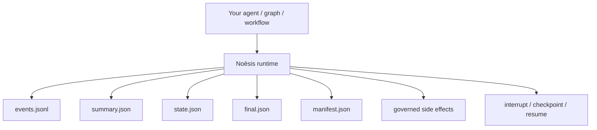
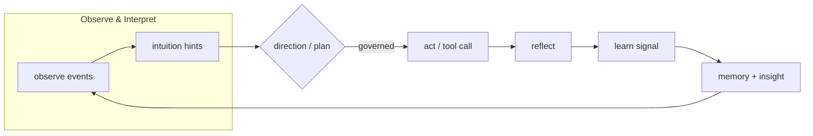

[](https://github.com/saraeloop/noesis/actions/workflows/pr-contracts.yml)
[](https://github.com/saraeloop/noesis/stargazers)
[](https://deepwiki.com/saraeloop/noesis)
[](#how-it-works)
[](pyproject.toml)
[](LICENSE)

# Noēsis (νόησις)

_Understanding, made observable._

Noēsis is a cognitive runtime for agent workflows. It turns each run into an auditable episode with a causal event chain, governed side effects, and resumable execution.

Each run produces a structured artifact pack (`events.jsonl`, `summary.json`, `state.json`, `manifest.json`) that can be inspected, audited, and verified. Terminal runs also write `final.json`. Paused runs stay unsealed until continuation.

Bring your own graphs, loops, tools, and prompts. Noēsis adds runtime evidence, verification, and governance boundaries without replacing your orchestrator or agent framework.

## Runtime boundary



## The problem

Agent frameworks can plan, call tools, mutate files, and take action across many steps. When something goes wrong, most teams still lack a durable, trustworthy record of what actually happened.

Two bad options:

- trust the framework's internal state
- build your own tracing, governance, and continuation layer

Noēsis gives you a third option: keep your orchestrator, but run it inside a runtime that records cognition, governs side effects, and preserves resumable execution.

## What Noēsis does

- **structured episodes**: every run emits `events.jsonl`, `summary.json`, and `state.json`. Terminal runs also seal `final.json` and `manifest.json`.
- **governed side effects**: review, audit, veto, or pause actions before they execute
- **resumable execution**: interrupt, checkpoint, and continue the same run
- **verification**: capture workspace evidence and assert expected changes
- **framework-agnostic integration**: wrap your own graphs, adapters, and workflows

## Minimal example

```python
import noesis as ns

episode_id = ns.run("Draft a weekly engineering update", intuition=True)

summary = ns.summary.read(episode_id)
timeline = list(ns.events.read(episode_id))

print(summary["metrics"]["success"])
print(timeline[0]["phase"], timeline[0].get("payload"))
```

## How it works

Noēsis models each run as explicit cognition phases:

**Observe -> Interpret -> Plan -> Direction -> Governance -> Act -> Reflect -> Learn -> Insight**

Each phase emits typed events with `caused_by` linkage, so the artifact trail preserves how the run moved from observation to action and reflection.

## Flow at a glance



## Artifact layout

By default, Noēsis writes artifacts under `.noesis/episodes/<episode_id>/`. Episode IDs are `ep_<ULID>`. Directories are flat: there is no per-label nesting. Group related runs with `process=` / `--process` instead of `ns.set(label=...)` (`label` is not a config key).

```text
.noesis/
  episodes/
    ep_01JH6Z2V9Q2K6Y6N0QZ7K2QW8C/
      events.jsonl
      summary.json
      state.json
      final.json      # terminal runs only
      manifest.json   # terminal runs only
      learn.jsonl     # optional
      prompts.jsonl   # optional, prompt provenance
      snapshots/      # when verify=... is set
        pre.json
        post.json
      checkpoints/    # paused / interrupted runs
  processes/
    index.json
    <process_id>.json
  index/
    episodes.jsonl    # best-effort EpisodeIndex (TTL 30 days)
```

Paused runs (for example enforce-mode veto with `governance_pause_on_veto=True`) write a checkpoint and **do not** seal `final.json` / `manifest.json` until continuation finishes.

## Governed side effects

```python
import noesis as ns
from noesis.exceptions import NoesisVeto


def run_shell(*, command: str, cwd: str | None = None, timeout_ms: int | None = None):
    return {"stdout": "ok", "stderr": "", "exit_code": 0, "command": command}


ns.set(
    shell_executor=run_shell,
    governance_mode="enforce",
    governance_pause_on_veto=True,
)

try:
    result = ns.governed_act(
        goal="List repository files",
        kind="shell",
        payload={
            "command": "ls -a",
            "cwd": ".",
            "timeout_ms": 2000,
        },
    )
    print(result)
except NoesisVeto as veto:
    print(f"Blocked by governance: {veto.advice}")
```

## Workspace verification

Pass `verify=` to `ns.run` / `ns.solve` with helpers from `noesis.verification` (also re-exported on `ns`):

```python
import noesis as ns

verify = (
    ns.file_exists("canary-rollout.json"),
    ns.file_contains("canary-rollout.json", "canary: true"),
    ns.only_modified(["canary-rollout.json"]),
)

episode_id = ns.solve(
    "Update config",
    using="my.module:adapter_fn",
    workspace=".",
    verify=verify,
)
```

`file_contains` is literal-only in v0.1: passing a compiled `re.Pattern` without `literal=True` raises `ValueError`. The CLI also rejects combining `--verify-no-modifications` with `--verify-only-modified`.

Verification writes `snapshots/pre.json` and `snapshots/post.json` and records the result on the episode summary.

## Pause, checkpoint, and continue

Do not call `interrupt` / `checkpoint` after a completed run. Terminal runs write `final.json` and reject later lifecycle mutations with `RunSealedError`.

Canonical approval path: pause during the run, then continue the **same** episode ID.

```python
import noesis as ns

ns.set(
    governance_mode="enforce",
    governance_pause_on_veto=True,
)

episode_id = ns.solve(
    task="Danger operation: delete production database",
    using=my_graph,
)

checkpoint_event = next(
    event
    for event in ns.events.read(episode_id)
    if event.get("phase") == "runtime" and event.get("event_type") == "run.checkpoint"
)
checkpoint_id = checkpoint_event["payload"]["checkpoint_id"]

# After human approval, continue the same run
episode_id = ns.resume_run(
    episode_id,
    checkpoint_id=checkpoint_id,
    using=my_graph,
)
```

You can also pause an **unsealed** run yourself:

```python
interrupt_id = ns.interrupt(episode_id, reason="awaiting approval")
checkpoint = ns.checkpoint(episode_id, caused_by=interrupt_id)
ns.resume_run(episode_id, checkpoint_id=checkpoint["checkpoint_id"], using=my_graph)
```

Rule of thumb:

- `resume()` emits lifecycle evidence only (`run.resume`)
- `resume_run()` emits `run.resume` and continues execution on the same run ID

## Install

Python >= 3.11.

```bash
git clone https://github.com/saraeloop/noesis.git
cd noesis
uv tool install .
# or: pipx install .
```

Run the demo:

```bash
uv run python examples/demo.py
```

The demo sets `runs_dir="./.noesis/episodes/demo"`, so its artifacts live under that custom root rather than the default `.noesis/episodes/` directory.

## Who it's for

**Builders / platform teams**: wrap LangGraph, CrewAI, or custom graphs with observable cognition and governed execution without rewriting your orchestrator.

**Applied researchers**: collect structured traces for benchmarks, ablations, evaluation, and papers.

**Ops / compliance / platform governance**: review immutable JSON artifacts showing what happened, what changed, and why side effects were allowed or blocked.

**Anyone deploying agents that act on real systems**: file writes, shell execution, API calls, config changes.

## Docs and links

- Quickstart: `docs/quickstart.mdx`
- Artifacts: `docs/explanation/artifacts.mdx`
- Python API: `docs/reference/python-api.mdx`
- CLI reference: `docs/reference/cli.mdx`
- Events schema: `docs/reference/events.mdx`
- Human-in-the-loop: `docs/guides/human-in-the-loop.mdx`
- Examples: `examples/README.md`

Published site: https://docs.noesis.systems

## Status

- Package: `noesis` v1.0.0
- Schema pack: summary 1.3.0, events 1.3.0, final 2.0.0
- Python: >= 3.11
- CI: contracts, schema guard, and release preparation run in GitHub Actions

## Community and support

Issues and discussions live on GitHub. Contributions are welcome. See `CONTRIBUTING.md`.

## Security

Report vulnerabilities privately through GitHub Security Advisories. See `SECURITY.md`.

## License

Apache 2.0. See `LICENSE`.

Copyright 2025 Sara Loera
