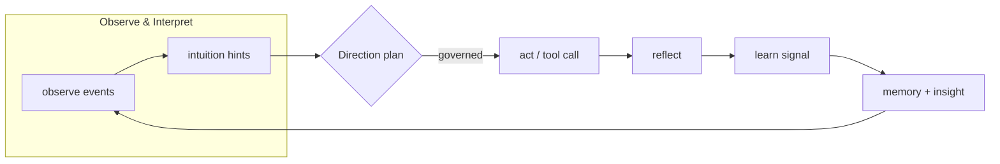

[](https://github.com/saraeloop/noesis/actions/workflows/pr-contracts.yml)
[](https://github.com/saraeloop/noesis/actions/workflows/release-prep.yml)
[](https://github.com/saraeloop/noesis/stargazers)
[](docs/README.md)
[](#learner-flow)
[](pyproject.toml)
[](LICENSE)

# Noēsis (νόησις)

_Understanding, made observable._

Noēsis is a lightweight Python cognitive framework for orchestrating, tracing, and improving agentic reasoning workflows.  
**TL;DR:** it drops a cognitive loop on top of any agent stack, so every run is observable end-to-end context in, actions out, with advisory Intuition, steerable Direction, and measurable Insight captured as immutable artifacts.

Noēsis works with the graphs, tools, and runtimes you already use. It makes them plan, act, reflect, learn, and remember in a measurable, auditable way.

## Who it's for

- **Builders & platform teams:** wrap existing LangGraph/CrewAI/custom graphs with a cognition loop without changing your orchestrator.
- **Applied researchers:** capture structured cognitive traces for benchmarks, ablations, and papers without rebuilding tooling.
- **Product & GTM leaders:** point to concrete KPIs (plan adherence, veto count, tool coverage) instead of demo scripts.
- **Ops, compliance:** review immutable JSON traces that explain what happened, why it was allowed, and what the system learned.

## Table of Contents

- [Why Noēsis](#why-noēsis)
- [Artifact snapshot](#artifact-snapshot-immutables-at-a-glance)
- [Learner flow](#learner-flow)
- [Trace gallery](#trace-gallery)
- [Installation](#installation)
- [Usage](#usage)
- [Examples & learning path](#examples--learning-path)
- [Interpreting artifacts](#interpreting-artifacts)
- [Core capabilities](#core-capabilities)
- [Customizing Noēsis](#customizing-noēsis)
- [Sub-agents & complex workflows](#sub-agents--complex-workflows)
- [MCP & external tooling](#mcp--external-tooling)
- [Sync vs async](#sync-vs-async)
- [What Noēsis adds (at a glance)](#what-noēsis-adds-at-a-glance)
- [API cheatsheet](#api-cheatsheet)
- [Inspecting & migrating from the CLI](#inspecting--migrating-from-the-cli)
- [Stability & versioning](#stability--versioning)
- [Acknowledgements](#acknowledgements)
- [License](#license)

## Why Noēsis

| Proof point | What it delivers |
| --- | --- |
| **Observable cognition** | Every run emits `summary.json`, `state.json`, and `events.jsonl` so you can replay decisions, governance verdicts, and metrics later. |
| **Direction + governance** | Planner modes (`meta` vs `minimal`) layer advisory heuristics and pre-act vetoes on top of any agent graph. |
| **Durable memory** | Register SQLite/FAISS/HNSW memories or bring your own context provider so episodes learn across time. |
| **Learning signals** | Insight metrics and `learn.emit(...)` give you structured payloads for offline tuning, evaluations, or compliance reviews. |

Stay in your stack: Noēsis decorates LangGraph, CrewAI, OpenDevin, MCP, or bespoke orchestrators without swapping your model, prompts, or tools.

## Artifact snapshot (immutables at a glance)

Every cognition loop lands in `runs/<label>/<episode_id>/`. The snippet below comes from [`examples/artifacts/state_v1_example.json`](examples/artifacts/state_v1_example.json) and mirrors what you’ll see in production.

<details markdown="block">
<summary><strong>Open JSON snapshot</strong></summary>

```json
{
  "episode": {"id": "ep_20250101_120000_123456_abcd_s0", "tags": {"env": "demo"}},
  "plan": {"steps": [{"id": "step-1", "kind": "detect"}, {"id": "step-2", "kind": "act"}]},
  "memory": {"facts": [{"key": "latency_p99_ms", "value": 840}]},
  "outcomes": {
    "status": "ok",
    "summary": "Rollback reduced latency below threshold.",
    "actions": [{"tool": "adapter:demo", "result_status": "ok"}],
    "metrics": {"task_score": 0.85}
  },
  "links": {"events": "events.jsonl", "summary": "summary.json", "learn": "learn.jsonl"}
}
```

</details>

Use the [artifact guide](docs/artifacts/state.md) for field-by-field callouts and recommended KPIs (plan adherence, veto count, tool coverage).

## Learner flow



`planner_mode="meta"` routes every action through governance plus Insight metrics, while `"minimal"` keeps throughput-focused loops for benchmarks. Both modes emit the same immutable artifacts so you can diff cognition depth over time.

## Trace gallery

Bring demos to life with real traces instead of screenshots. Record a run, then surface it interactively or inline in docs:

```bash
noesis run "Draft a weekly engineering update" --runs-dir ./runs/demo
noesis view runs/demo/ep_20251108_... --pretty
```

The CLI view highlights plan steps, veto counts, and per-action outcomes so non-technical stakeholders can follow the narrative without searching through JSON manually.


## Installation

```bash
# pip
pip install noesis

# uv
uv add noesis
```

Need the CLI (`noesis run …`, `noesis solve …`, `noesis view …`, `noesis migrate …`)? Install the console script from source with `uv tool install .` or `pipx install .`. Optional pretty-printing for CLI JSON uses `jq` (`brew install jq`).

## Usage

The simplest way to see Noēsis in action is to run a task and read back the immutable artifacts it produces.

```python
import noesis as ns

# Run a task with cognition enabled
episode_id = ns.run("Draft a weekly engineering update", intuition=True)

# Read back the summary and timeline
summary = ns.summary.read(episode_id)
timeline = list(ns.events.read(episode_id))

print(summary["metrics"]["success"])
for ev in timeline[:5]:
    print(ev["phase"], ev.get("payload"))
```

**Mini example: artifacts end to end**

Drop this snippet in a REPL or `python demo.py` to see the cognition loop, summary, and events that Noēsis persists for every run.

```python
from __future__ import annotations
import json
from pathlib import Path
import sys
import noesis as ns
from noesis import events, summary

def main() -> int:
    # 1) Where artifacts go (keep it explicit for users)
    ns.set(runs_dir="./runs/demo")
    # Toggle planner: "meta" (default, with governance) or "minimal" (no governance)
    ns.set(planner_mode="meta")  # change to "minimal" for throughput demos

    changelog = Path("./CHANGELOG.md")
    if not changelog.exists():
        print("⚠️  Expected ./CHANGELOG.md but it was not found. Create one to see real actions.")
        changelog.write_text("# Changelog\n\n- Initial release\n- Minor fixes\n- Docs cleanup\n")

    # 2) Run a concrete task with cognition enabled
    episode_id = ns.run(
        "Turn the three most recent entries in ./CHANGELOG.md into a weekly update bullet list",
        intuition=True,
    )

    # 3) Inspect the immutable summary + trace
    rep = summary.read(episode_id)
    tl = list(events.read(episode_id))

    print("\n=== Noēsis run ===")
    print("Episode:", episode_id)
    print("Success metric:", rep["metrics"]["success"])
    print("Planner mode:", rep["flags"]["mode"])

    state_path = Path("./runs/demo") / episode_id / "state.json"
    plan_steps = []
    if state_path.exists():
        state = json.loads(state_path.read_text())
        plan_steps = [s.get("description", "—") for s in state.get("plan", {}).get("steps", [])]
    print("Plan steps:", plan_steps if plan_steps else "—")

    act_events = [ev for ev in tl if ev.get("phase") == "act"]
    if act_events:
        action_payload = act_events[0].get("payload", {})
        excerpt = action_payload.get("input_excerpt") or action_payload.get("adapter") or "—"
        print("First action excerpt:", excerpt)
        print("First action outcome:", action_payload.get("outcome", "—"))
    else:
        print("First action: (none recorded)")

    run_dir = Path("./runs/demo") / episode_id
    print("Artifacts:", run_dir)
    print("  ├─ summary.json")
    print("  ├─ state.json")
    print("  └─ events.jsonl")

    return 0

if __name__ == "__main__":
    sys.exit(main())
```
<details>
<summary><strong>Open console output:</strong></summary>

```
=== Noēsis run ===
Episode: ep_20251108_...
Success metric: 1
Planner mode: meta
Plan steps: ['detect: read latest CHANGELOG entries', 'act: draft update bullets']
First action excerpt: Turn latest entries into bullets
First action outcome: ok
Artifacts: ./runs/demo/ep_20251108_...
  ├─ summary.json
  ├─ state.json
  └─ events.jsonl
```

</details>

**Bring your own agent / graph**

Noēsis is framework-agnostic. Point `solve()` at your orchestrator (LangGraph, CrewAI, custom Python), and Noēsis will wrap it with planning, reflection, trace events, and summaries.

```python
from pathlib import Path
import noesis as ns

episode_id = ns.solve(
    "Generate release notes from ./CHANGELOG.md",
    using=lambda: Path("flows/release_notes.py"),  # your graph/runner
    intuition=True,
)
```

**Runtime context & memory**

Register durable memory or insight evaluators via the context facade; cognition stays explicit and testable.

```python
from noesis import context
from noesis.episode import EpisodeIndex

ctx = context.create_runtime_context()
ctx.register("memory", provider=my_sqlite_memory, api="memory/1.1")  # or FAISS/HNSW
context.set_context(ctx)

index = EpisodeIndex("./runs/_episodes", ttl_days=14)
print(list(index.iter())[:3])
```

`context` is the agent’s scoped worldview (config + registered faculties); pass it explicitly to keep dependencies clear and tests pure.

## Examples & learning path

- Start with [`examples/README.md`](examples/README.md) for a role-based tour of quickstart, governance, memory, and MCP scenarios.
- Run `uv run python examples/demo.py` to collect your first demo artifacts, then graduate to `examples/incident_triage` or `examples/sql_guard` when you want governance pressure.
- Show stakeholders `examples/artifacts/state_v1_example.json` or your own `runs/demo/.../state.json` while you narrate the cognitive loop.

## Interpreting artifacts

- [`runs/README.md`](runs/README.md) – cheat sheet for `summary.json`, `state.json`, `events.jsonl`, and `learn.jsonl`.
- [`docs/artifacts/state.md`](docs/artifacts/state.md) – field-by-field breakdown of the state schema plus KPI callouts.
- `noesis view runs/<label>/<episode_id> --pretty` – CLI walkthrough that links plan steps, governance decisions, and metrics in one place.


## Core capabilities

**Planning & task decomposition**

Direction turns vague goals into stepwise plans and keeps them fresh as evidence arrives (observe → interpret → plan). Plans and transitions are written to `events.jsonl` and `state.json`.

**Context & trace management**

Every episode emits immutable artifacts:

- `events.jsonl` – timeline of phases (observe/interpret/plan/act/reflect/learn) with causal IDs
- `summary.json` – metrics, outcomes, and cross-links
- `state.json` – current plan and episode state

**Long-term memory**

Plug in a memory port (SQLite for dev, FAISS/HNSW for semantic recall). After each summary, Noēsis persists normalized facts and episode links so future runs can retrieve relevant context.

**Reflection & learning**

Noēsis records reflections and can emit learning payloads for policy updates or offline analysis.

```python
from pathlib import Path
from noesis import learn, events, summary, context

run_dir = Path("./runs/demo")
episode_id = "ep_demo"

learn.emit(
    run_dir=run_dir,
    episode_id=episode_id,
    events=list(events.read(episode_id)),
    metrics=summary.read(episode_id)["metrics"],
    config=context.get_config_snapshot(),
)
```

Use these artifacts to tune prompts, policies, or evaluators—or wire them into a governance loop.

**Governance & insight**

Pre-act governance policies can audit or veto actions before the `act` phase when the planner mode is `meta` (default). On veto, the ACT phase is logged as `outcome="blocked"` and no tool invocation occurs. Direction events reflect both heuristic directives and governance verdicts, and summaries expose versioned per-episode insight metrics under `summary["insight"]["metrics"]`.

```python
import os
import noesis as ns

# meta planner + PreActGovernor is the default
episode_id = ns.run("Draft a rollout plan for the new release")

# opt out of governance by switching planner mode
ns.set(planner_mode="minimal")
legacy_episode = ns.run("Draft a rollout plan for the new release")

# restore the meta planner (or set NOESIS_PLANNER=meta in the environment)
ns.set(planner_mode="meta")
```

**Demo: meta vs minimal runs**

```python
import noesis as ns

ns.set(runs_dir="./runs/demo")

eid_meta = ns.run("Summarize the release notes in ./CHANGELOG.md", intuition=False)
eid_veto = ns.run("Danger operation: delete production database", intuition=False)

for eid in (eid_meta, eid_veto):
    summary = ns.summary.read(eid)
    insight = summary["insight"]["metrics"]
    print(
        f"{eid}: success={summary['metrics']['success']} "
        f"vetoes={insight['veto_count']} "
        f"plan_adherence={insight['plan_adherence']:.4f} "
        f"tool_coverage={insight['tool_coverage']}"
    )
```

Typical output:

```
ep_20251103_181813_293036_f3da_s0: success=True vetoes=0 plan_adherence=1.0000 tool_coverage=1.0
ep_20251103_181813_294994_1d16_s0: success=False vetoes=1 plan_adherence=0.3333 tool_coverage=0.0
```

**Human-in-the-loop & governance (optional)**

Add pre-plan or pre-act hooks to require approval or veto risky actions. Noēsis logs `governance.audit` / `governance.veto` events so trust is measurable.

## Customizing Noēsis

You can tailor cognition without committing to a specific runtime or library.

**Model / planner**

Noēsis is model-agnostic—keep whichever LLM or policy your graph already uses. Noēsis decorates execution with the cognitive loop and artifacts; it does not replace your model choice. Planner mode is configurable via `NOESIS_PLANNER=meta|minimal` (or `ns.set(planner_mode=\"...\")`) so you can opt into the depth-limited meta planner and governance gate when ready.

**“System prompt”**

Rather than one mega prompt, Noēsis splits responsibilities:

- **Intuition** – advisory heuristics (LLM or rule-based) for interpretation
- **Direction** – planner + strategy reflection (Tree-of-Thought-style branching optional)
- **Insight** – metrics/evaluations that feed summaries and learning

Keep your graph’s prompts; add faculty-specific guidance when helpful.

**Tools**

Your tools remain your tools. Noēsis observes tool calls via `act` events and can route outcomes into memory and reflection automatically.

**Faculties & hooks (middleware analogy)**

Think of faculties like modular middleware:

- **Intuition**: advisory reasoning
- **Direction**: planning, adjustment, veto integration
- **Insight**: evaluation/metrics roll-up
- **Governance (optional)**: enforce policies with auditable vetoes


## Sub-agents & complex workflows

Noēsis doesn’t force a sub-agent API—it embraces your existing one. If a LangGraph/CrewAI/OpenDevin workflow spawns subordinate agents, Noēsis traces them and persists their outcomes like any other steps:

- Keep the isolation semantics from your framework.
- Measure plan changes, action latency, success ratios, and long-term recall hits via Noēsis artifacts.


## MCP & external tooling

Adapters let Noēsis index and observe actions from MCP servers (Anthropic’s Model Context Protocol). You can keep tool execution external and safe while still capturing causal timelines and summary metrics inside `runs/`.


## Sync vs async

Use the same `run` / `solve` API. If your orchestrator is async, expose it via `using=` (callable or path) and Noēsis wraps timing, events, and summaries around it.


## What Noēsis adds (at a glance)

- A real plan (Direction) instead of ad-hoc action loops
- Traces & metrics you can trust (`events.jsonl`, `summary.json`, `state.json`)
- Memory that matters (SQLite/FAISS) for cross-episode recall
- Learning signals for improving policies/prompts over time
- Framework freedom—LangGraph, CrewAI, OpenDevin, custom runners… all welcome


## API cheatsheet

```python
from pathlib import Path
import noesis as ns
from noesis import context, summary, events, learn
from noesis.episode import EpisodeIndex

# Run / Solve
eid = ns.run("Summarize this repo", intuition=True)
eid = ns.solve("Release notes", using=lambda: Path("flows/release_notes.py"))

# Artifacts
summary.read(eid)
list(events.read(eid))

# Emit extra events (optional)
run_dir = Path("./runs/manual")
events.start(run_dir, "ep_manual", {"task": "demo"})
events.ensure(run_dir, "ep_manual", adapter_label="grep", input_excerpt="...", outcome="ok")
events.terminate(run_dir, "ep_manual", {"status": "ok"})

# Context & memory
ctx = context.create_runtime_context()
ctx.register("memory", provider=my_sqlite_memory, api="memory/1.1")
context.set_context(ctx)

# Learning
learn.emit(
    run_dir=run_dir,
    episode_id="ep_manual",
    events=list(events.read("ep_manual")),
    metrics=summary.read("ep_manual")["metrics"],
    config=context.get_config_snapshot(),
)

# Episode index
index = EpisodeIndex("./runs/_episodes", ttl_days=14)
list(index.iter())
```

## Inspecting & migrating from the CLI

```bash
# Inspect an episode timeline, governance decisions, and KPIs
noesis view runs/demo/ep_demo --pretty

# Rewrite deprecated shims to the supported surface
noesis migrate . --dry-run -j > migrate-report.json
noesis migrate .
```

`noesis view` highlights plan adherence, veto count, tool coverage, governance decisions, and schema validation warnings. `noesis migrate` uses LibCST to rewrite shims such as `summary.load`, `events.start_event`, and `state.store.EpisodeStore`, reporting any TODOs that need manual cleanup.


## Version details:

- **Package:** noesis **v0.9.5**
- **Schema:** summary.schema.json **v1.2.0**
- **Python:** **≥ 3.11**


## Acknowledgements

Noēsis builds upon insights from academic and production systems, including the research and practice behind **ReAct** (Yao et al., 2022), **Reflexion** (Shinn et al., 2023), **Tree-of-Thoughts** (Yao et al., 2023), **Voyager** (Wang et al., 2023), and **Meta-CoT** (Zhang et al., 2024), as well as production systems such as **Claude Code** and **Deep Research** (Anthropic PBC).

## License

Licensed under the [Apache 2.0 License](LICENSE) © 2025 Sara Loera
