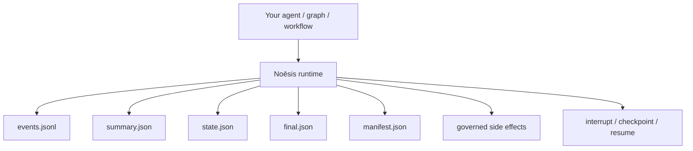
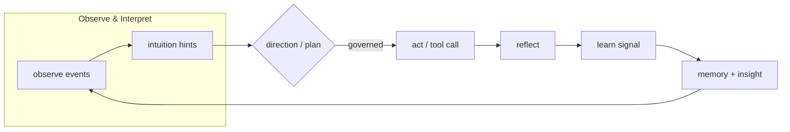

[](https://github.com/saraeloop/noesis/actions/workflows/pr-contracts.yml)
[](https://github.com/saraeloop/noesis/stargazers)
[](https://deepwiki.com/saraeloop/noesis)
[](#how-it-works)
[](pyproject.toml)
[](LICENSE)

# Noēsis (νόησις)

_Understanding, made observable._

Noēsis is a cognitive runtime for agent workflows. It turns each run into an auditable episode with a causal event chain, governed side effects, and resumable execution.

Each run produces structured artifacts that can be inspected, audited, and verified. Terminal runs seal `events.jsonl`, `summary.json`, `state.json`, `final.json`, and `manifest.json`; paused runs keep append-only trace and state evidence until continuation.

Bring your own graphs, loops, tools, and prompts. Noēsis adds runtime evidence, verification, and governance boundaries without replacing your orchestrator or agent framework.

## Runtime boundary



## The problem

Agent frameworks can plan, call tools, mutate files, and take action across many steps. When something goes wrong, most teams still lack a durable, trustworthy record of what actually happened.

Two bad options:

- trust the framework's internal state
- build your own tracing, governance, and continuation layer

Noēsis gives you a third option: keep your orchestrator, but run it inside a runtime that records cognition, governs side effects, and preserves resumable execution.

## What Noēsis does

- **structured episodes**: every run emits append-only trace and state artifacts; terminal runs seal the final pack
- **governed side effects**: review, audit, veto, or pause actions before they execute
- **resumable execution**: interrupt, checkpoint, and continue the same run
- **verification**: capture workspace evidence and assert expected changes
- **framework-agnostic integration**: wrap your own graphs, adapters, and workflows

## Minimal example

```python
import noesis as ns

episode_id = ns.run("Draft a weekly engineering update", intuition=True)

summary = ns.summary.read(episode_id)
timeline = list(ns.events.read(episode_id))

ns.set(
    governance_mode="enforce",
    governance_pause_on_veto=True,
    governance_failure_policy="fail_closed",
    prompt_provenance_enabled=True,
    prompt_provenance_mode="full",
)

# Start the run
episode_id = ns.solve(
    task="Apply canary rollout config to production",
    using=lambda: my_agent(),
    workspace="./repo",
    verify=(
        ns.file_exists("canary-rollout.json"),
        ns.only_modified(["canary-rollout.json"]),
    ),
)

# Governance vetoes the risky write →
# run automatically emits interrupt + checkpoint
# UI shows: run is paused, waiting on you
```

## How it works

Noēsis models each run as explicit cognition phases:

**Observe -> Interpret -> Plan -> Govern -> Act -> Reflect -> Learn**

Each phase emits typed events with `caused_by` linkage, so the artifact trail preserves how the run moved from observation to action and reflection.

## Flow at a glance



## Artifact layout

By default, Noēsis writes artifacts under `.noesis/episodes/`:

```text
.noesis/
  episodes/
    ep_.../
      events.jsonl
      summary.json
      state.json
      final.json
      manifest.json
      learn.jsonl     # optional
      prompts.jsonl   # optional
      snapshots/
        pre.json
        post.json
```

## Governed side effects

```python
import noesis as ns
from noesis.exceptions import NoesisVeto


def run_shell(*, command: str, cwd: str | None = None, timeout_ms: int | None = None):
    return {"stdout": "ok", "stderr": "", "exit_code": 0, "command": command}


ns.set(
    shell_executor=run_shell,
    governance_mode="enforce",
    governance_pause_on_veto=True,
)

try:
    result = ns.governed_act(
        goal="List repository files",
        kind="shell",
        payload={
            "command": "ls -a",
            "cwd": ".",
            "timeout_ms": 2000,
        },
    )
    print(result)
except NoesisVeto as veto:
    print(f"Blocked by governance: {veto.advice}")
```

## Workspace verification

Use `verify=...` with a workspace root to assert expected file changes. The
runtime writes pre/post workspace snapshots and records verification state in
the episode artifacts.

```python
import noesis as ns

verify = (
    ns.file_exists("canary-rollout.json"),
    ns.file_contains("canary-rollout.json", "canary: true"),
    ns.only_modified(["canary-rollout.json"]),
)

episode_id = ns.solve(
    task="Update rollout config",
    using="my.module:adapter_fn",
    workspace="./repo",
    verify=verify,
)
```

Common constraints:

- `file_exists(path)` requires a file to exist after the run.
- `file_contains(path, text)` matches literal text. It does not evaluate regular
  expressions; compiled patterns must be passed with `literal=True`, which
  matches the pattern text.
- `only_modified(paths)` fails when files outside the allowlist change.
- `no_modifications()` requires a clean post-run workspace.

## Artifact contract

Terminal runs write a sealed artifact pack:

```text
.noesis/episodes/ep_.../
  events.jsonl
  state.json
  summary.json
  final.json
  manifest.json
```

Paused runs remain unsealed until continuation or termination. They keep
`events.jsonl`, `state.json`, and `learn.jsonl`, but do not write `final.json`
or the terminal `manifest.json` yet.

## Pause, checkpoint, and continue

```python
import noesis as ns

episode_id = ns.solve(
    task="Apply canary rollout config to production",
    using=my_graph,
    workspace="./repo",
    verify=verify,
)

interrupt_id = ns.interrupt(episode_id, reason="awaiting approval")
checkpoint = ns.checkpoint(episode_id, caused_by=interrupt_id)

# Emit resume evidence only.
resume_event_id = ns.resume(episode_id, checkpoint_id=checkpoint["checkpoint_id"])

# Emit run.resume and continue execution on the same run ID.
episode_id = ns.resume_run(
    episode_id,
    checkpoint_id=checkpoint["checkpoint_id"],
    using=my_graph,
)
```

Rule of thumb:

- `interrupt()` and `checkpoint()` create auditable pause evidence.
- `checkpoint()` records the event offset, last event ID, state hash, artifact
  digest, and adapter label.
- `resume()` emits lifecycle evidence only.
- `resume_run()` emits `run.resume` and continues execution on the same run ID.
- Resume fails if the run is sealed, the checkpoint is missing/stale, or the
  continuation adapter does not match the checkpoint adapter contract.

## Install

Python >= 3.11.

```bash
git clone https://github.com/saraeloop/noesis.git
cd noesis
uv tool install .
# or: pipx install .
```

Run the demo:

```bash
uv run python examples/demo.py
```

## Who it's for

**Builders / platform teams**: wrap LangGraph, CrewAI, or custom graphs with observable cognition and governed execution without rewriting your orchestrator.

**Applied researchers**: collect structured traces for benchmarks, ablations, evaluation, and papers.

**Ops / compliance / platform governance**: review immutable JSON artifacts showing what happened, what changed, and why side effects were allowed or blocked.

**Anyone deploying agents that act on real systems**: file writes, shell execution, API calls, config changes.

## Docs and links

- Artifacts guide: `docs/artifacts/state.md`
- Schema index: `docs/app/reference/schema-index.mdx`
- CLI reference: `docs/app/reference/cli/page.mdx`
- Quickstart guide: `docs/app/guides/quickstart/page.mdx`
- Examples: `examples/README.md`

## Status

- Package: `noesis` v1.0.0
- Schema pack: summary/state/events/kpi v1.0.0
- Python: >= 3.11
- CI: contracts, schema guard, and release preparation run in GitHub Actions

## Community and support

Issues and discussions live on GitHub. Contributions are welcome. See `CONTRIBUTING.md`.

## Security

Report vulnerabilities privately through GitHub Security Advisories. See `SECURITY.md`.

## License

Apache 2.0. See `LICENSE`.

Copyright 2025 Sara Loera
