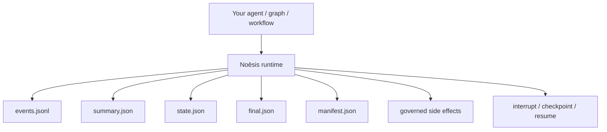
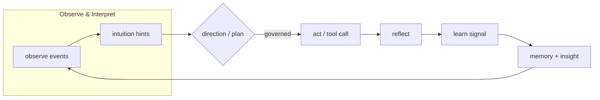

[](https://github.com/saraeloop/noesis/actions/workflows/pr-contracts.yml)
[](https://github.com/saraeloop/noesis/stargazers)
[](https://deepwiki.com/saraeloop/noesis)
[](#core-concepts)
[](pyproject.toml)
[](LICENSE)

# Noēsis (νόησις)

_Understanding, made observable._

Noēsis is a cognitive runtime for agent workflows. It turns each run into an auditable episode with a causal event chain, governed side effects, and resumable execution, with state-hash validation across checkpoint and continuation.

Each run produces a structured artifact pack (`events.jsonl`, `summary.json`, `state.json`, `manifest.json`) that can be inspected, audited, and verified.

Bring your own graphs, loops, tools, and prompts. Noēsis adds runtime evidence, verification, and governance boundaries without replacing your orchestrator or agent framework.

---

## The problem

Agent frameworks can plan, call tools, mutate files, and take action across many steps. But when something goes wrong — or when something should have been stopped before it ran — teams often lack a durable, trustworthy record of what actually happened.

Noēsis provides the missing middle ground: observable execution, governed side effects, and resumable runs without replacing the orchestrator you already have.

---

## What makes Noēsis different

Other tools record what happened. Noēsis adds runtime boundaries around how execution proceeds and makes those boundaries visible in the artifact trail.

| | Noēsis | Logging / tracing | Auth / receipts |
|---|---|---|---|
| Causal event chain in durable artifacts | ✓ | — | — |
| Governance pause with preserved run state | ✓ | — | — |
| Resume the **same run** after human approval | ✓ | — | — |
| State-hash validation across checkpoint/resume | ✓ | — | — |
| Deterministic controls for runtime/testing | ✓ | — | — |
| Sealed artifact contract per episode | ✓ | partial | — |

The pause is a suspended execution with preserved run state. Approval continues the same run from that point rather than starting over from scratch.

---

## Minimal example — governed execution with pause

```python
import noesis as ns

def my_agent():
    # your agent, graph, or workflow here
    pass

ns.set(
    governance_mode="enforce",
    governance_pause_on_veto=True,
    governance_failure_policy="fail_closed",
    prompt_provenance_enabled=True,
    prompt_provenance_mode="full",
)

# Start the run
episode_id = ns.solve(
    task="Apply canary rollout config to production",
    using=lambda: my_agent(),
    workspace="./repo",
    verify=(
        ns.file_exists("canary-rollout.json"),
        ns.only_modified(["canary-rollout.json"]),
    ),
)

# Governance vetoes the risky write →
# run automatically emits interrupt + checkpoint
# UI shows: run is paused, waiting on you

# Human reviews and approves →
checkpoint = ns.checkpoint(episode_id)
checkpoint_id = str(checkpoint["checkpoint_id"])

# Same run continues from exact point — not a reset
episode_id = ns.resume_run(
    episode_id,
    checkpoint_id=checkpoint_id,
    using=lambda: my_agent(),
)

# Artifacts seal
```

---

## Runtime boundary



---

## Cognitive phases

Each run passes through enforced phases. The order cannot be skipped or reordered:

```
Observe → Interpret → Plan → Govern → Act → Reflect → Learn
```

Each phase emits typed events with `caused_by` linkage, so the artifact trail preserves how the run moved from observation to action and reflection.

## Flow at a glance



---

## Artifact contract

Every episode writes a sealed artifact pack:

```text
.noesis/
  episodes/
    ep_.../
      events.jsonl      ← append-only causal event chain
      summary.json      ← outcome, metrics, veto count, top flags
      state.json        ← current plan and episode state
      final.json        ← terminal sealing record
      manifest.json     ← tamper-evident hash ledger
      learn.jsonl       ← optional learning payloads
      prompts.jsonl     ← optional prompt provenance
      snapshots/
        pre.json        ← workspace snapshot before act
        post.json       ← workspace snapshot after act
```

**Episode statuses:** `completed` · `completed_with_incidents` · `failed_all_vetoed` · `interrupted` · `needs_review`

---

## Runtime guarantees

- event history stays append-only across pause and continuation
- resume validates the checkpoint against persisted run state before continuing
- governance failures are recorded in the artifact trail instead of being swallowed

---

## Governed side effects

```python
import noesis as ns

def run_shell(*, command: str, cwd: str | None = None, timeout_ms: int | None = None):
    import subprocess
    result = subprocess.run(command, shell=True, cwd=cwd, capture_output=True, text=True)
    return {"stdout": result.stdout, "stderr": result.stderr, "exit_code": result.returncode}

ns.set(
    shell_executor=run_shell,
    governance_mode="enforce",
    governance_pause_on_veto=True,
)

try:
    result = ns.governed_act(
        goal="Apply deployment config",
        kind="shell",
        payload={"command": "kubectl apply -f canary.yaml"},
        risk_tags=["production", "irreversible"],
    )
except ns.NoesisVeto as veto:
    print(f"Blocked: {veto.advice}")
    # run is paused, not dead — checkpoint was created
```

---

## Workspace verification

```python
import noesis as ns

episode_id = ns.solve(
    task="Update rollout config",
    using=lambda: my_agent(),
    workspace="./repo",
    verify=(
        ns.file_exists("canary-rollout.json"),
        ns.file_contains("canary-rollout.json", "canary: true"),
        ns.only_modified(["canary-rollout.json"]),
    ),
)
```

Verification produces `snapshots/pre.json` and `snapshots/post.json` and records verification state in the episode artifacts.

---

## Deterministic replay

```python
from noesis import DeterministicClock, DeterministicRNG, SessionBuilder

clock = DeterministicClock(tick_ms=1.0)
rng = DeterministicRNG(seed=42)
restore = rng.patch_os_urandom()  # intercepts os.urandom at OS boundary

session = (
    SessionBuilder.from_env()
    .with_determinism(clock=clock, rng=rng)
    .build()
)

episode_id = session.solve(task="...", using=lambda: my_agent())
restore()
```

`patch_os_urandom()` intercepts entropy at the OS boundary so deterministic runs and replay drift checks can be exercised under a fixed seed.

---

## Shadow governance

```python
ns.set(governance_mode="audit")  # observe without blocking

episode_id = ns.solve(task="...", using=lambda: my_agent())
summary = ns.summary.read(episode_id)

print(summary["metrics"]["veto_count"])        # enforced vetoes: 0 (audit mode)
print(summary["metrics"]["would_veto_count"])  # counterfactual: what would have been blocked
```

## Quickstart

Python >= 3.11.

```bash
git clone https://github.com/saraeloop/noesis.git
cd noesis
uv tool install .
```

Run the demo:

```bash
uv run python examples/demo.py
```

---

## Who it's for

**Builders / platform teams** — wrap LangGraph, CrewAI, or custom graphs with observable cognition and governed execution without rewriting your orchestrator.

**Applied researchers** — collect structured traces for benchmarks, ablations, evaluation, and papers. Every run is a structured object, not a log file.

**Ops / compliance / platform governance** — review immutable JSON artifacts showing what happened, what changed, and why side effects were allowed or blocked. The governance layer is auditable, not transparent.

**Anyone deploying agents that act on real systems** — file writes, shell execution, API calls, config changes. If an action has real-world impact, it should pass through a governed boundary.

---

## Config flags

```python
ns.set(
    governance_mode="enforce",          # "off" | "audit" | "enforce"
    governance_pause_on_veto=True,      # veto → interrupt + checkpoint
    governance_failure_policy="fail_closed",
    governance_timeout_ms=5000,
    prompt_provenance_enabled=True,
    prompt_provenance_mode="full",      # "full" | "hash_only" | "redacted"
    direction_min_confidence=0.6,
    runs_dir=".noesis/episodes",
)
```

---

## Docs and links

- Quickstart guide: `docs/quickstart.mdx`
- Core concepts: `docs/explanation/core-concepts.mdx`
- Artifacts guide: `docs/explanation/artifacts.mdx`
- Python API (including lifecycle + failure modes): `docs/reference/python-api.mdx`
- CLI reference: `docs/reference/cli.mdx`
- Human approval workflow: `docs/guides/human-in-the-loop.mdx`
- Adapter integration + pitfalls: `docs/guides/integrate-adapters.mdx`
- Examples: `examples/README.md`

---

## Troubleshooting quick checks

- Run paused after a governance veto and no `final.json`/`manifest.json`: expected with `governance_pause_on_veto=True`. Create a checkpoint and continue with `resume_run(...)` when approved.
- `resume(...)` only records lifecycle evidence; it does not continue execution. Use `resume_run(...)` to continue the same run.
- `resume_run(...)` for `ns.solve(...)` checkpoints requires a matching `using=` adapter. Otherwise Noēsis raises `ResumeAdapterRequiredError` or `ResumeAdapterMismatchError`.
- Once a run is sealed, lifecycle mutations are rejected with `RunSealedError`.

```python
checkpoint = ns.checkpoint(episode_id)
episode_id = ns.resume_run(
    episode_id,
    checkpoint_id=checkpoint["checkpoint_id"],
    using=my_graph,
)
```

---

## Versioning and stability

- Package: `noesis` v1.0.0
- Schema pack: summary/state/events/kpi v1.0.0
- Python: >= 3.11
- CI: contracts, schema guard, and release preparation run in GitHub Actions

---

## Community and support

Issues and discussions live on GitHub. Contributions welcome. See `CONTRIBUTING.md`.

## Security

Report vulnerabilities privately through GitHub Security Advisories. See `SECURITY.md`.

## License

Apache 2.0. See `LICENSE`.

Copyright 2025 Sara Loera
