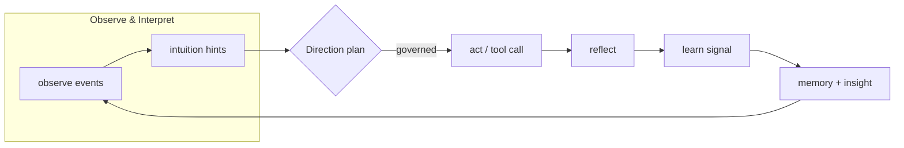

[](https://github.com/saraeloop/noesis/actions/workflows/pr-contracts.yml)
[](https://github.com/saraeloop/noesis/stargazers)
[](https://deepwiki.com/saraeloop/noesis)
[](#core-concepts)
[](pyproject.toml)
[](LICENSE)

# Noēsis (νόησις)

_Understanding, made observable._

Noēsis is a lightweight Python cognitive framework for orchestrating and tracing agentic reasoning. **TL;DR:** it drops an explicit cognitive loop on top of any agent stack, so every run is an observable episode – context in, actions out – with Intuition, Direction, and Insight captured as immutable artifacts.

Noēsis works with the graphs, tools, and runtimes you already use. It doesn’t replace your models or orchestrator; it makes their cognition legible.

## Who it’s for
- **Builders / platform teams:** wrap LangGraph, CrewAI, or custom graphs with cognition without rewrites.
- **Applied researchers:** collect structured traces for benchmarks, ablations, and papers.
- **Product & GTM:** point to concrete KPIs (plan adherence, veto count, tool coverage).
- **Ops & compliance:** review immutable JSON traces showing what happened and why it was allowed.

## Why Noēsis?
| Proof point | What it gives you |
| --- | --- |
| **Observable cognition** | Each run emits `summary.json`, `state.json`, and `events.jsonl` for replay and evaluation. |
| **Direction + guardrails** | Planner modes (`meta` vs `minimal`) layer planning and governance over any agent graph. |
| **Durable memory** | Plug in SQLite/FAISS/HNSW (or your own provider) so episodes learn across time. |
| **Learning signals** | Insight metrics and `learn.emit(...)` provide structured payloads for audits and tuning. |

## Core concepts
- Phases: **Observe → Interpret → Plan → Govern → Act → Reflect → Learn**

Flow at a glance:



- Artifacts (under `runs/<label>/<episode_id>/`):
  - `events.jsonl` – timeline with causal IDs
  - `summary.json` – metrics, outcome, cross-links
  - `state.json` – current plan and episode state
  - `manifest.json` – SHA-256 + size ledger for tamper evidence
  - `learn.jsonl` (optional) – learning payloads

## Quickstart
> Python ≥ 3.12. Source-first.

Install and run a demo:

```bash
# clone
git clone https://github.com/saraeloop/noesis.git
cd noesis

# install console script from source
uv tool install .
# or: pipx install .

# optional for pretty JSON in CLI examples
brew install jq
```

Minimal run (emits artifacts to `./runs` by default):

```python
import noesis as ns

episode_id = ns.run("Draft a weekly engineering update", intuition=True)
summary = ns.summary.read(episode_id)
timeline = list(ns.events.read(episode_id))

print(summary["metrics"]["success"])
print(timeline[0]["phase"], timeline[0].get("payload"))
```

Artifacts layout:

```
runs/
  demo/              # label (configurable)
    ep_.../          # episode id
      summary.json
      state.json
      events.jsonl
      manifest.json
      learn.jsonl    # optional
```

For a fuller tour: `uv run python examples/demo.py`

## Bring your own agent / graph
Noēsis is framework-agnostic—decorate your orchestrator and keep your tools/prompts:

```python
from pathlib import Path
import noesis as ns

episode_id = ns.solve(
    "Generate release notes from ./CHANGELOG.md",
    using=lambda: Path("flows/release_notes.py"),  # your graph/runner
    intuition=True,
)
```

Toggle governance depth:

```python
import noesis as ns

ns.set(runs_dir="./runs/demo")
ns.set(planner_mode="meta")      # with governance (default)
ns.run("Summarize release notes", intuition=False)

ns.set(planner_mode="minimal")   # opt out for throughput
ns.run("Summarize release notes", intuition=False)
```

## Docs & links
- Artifacts guide: `docs/artifacts/state.md`
- Runs cheat sheet: `runs/README.md`
- Schema index: `docs/app/reference/schema-index.mdx`
- CLI reference: `docs/app/reference/cli/page.mdx`
- Quickstart guide: `docs/app/guides/quickstart/page.mdx`
- Examples overview: `examples/README.md`

## Versioning & stability
- Package: `noesis` v1.0.0
- Schema pack: summary/state/events/kpi v1.0.0
- Python: ≥ 3.12
- CI: contracts, schema guard, and release prep run in GitHub Actions

## Community & support
- Issues and discussions on GitHub.
- Contributions welcome—see `CONTRIBUTING.md`.

## Security
- Please report vulnerabilities privately via GitHub security advisories; see `SECURITY.md` for the full policy.

## License
Apache 2.0. See `LICENSE` © 2025 Sara Loera
