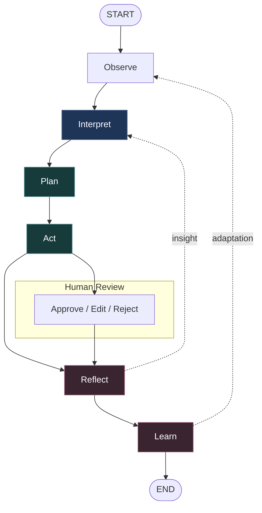

import { Callout, Steps, Tabs } from 'nextra/components'

# Thinking in Noēsis

Noēsis helps you model and supervise agent cognition with a tiny, stable API. You bring your graphs or tools (LangGraph, CrewAI, plain functions, and more); Noēsis wraps them in an observable cognitive loop with explicit planner modes and a hardened governance layer:

- **Observe** → capture raw task and context
- **Interpret** (**Intuition**) → extract signals, risks, and intent
- **Plan** (**Intuition → Direction**) → propose or patch the next action, passing intent to governance
- **Govern** (**Governance**) → audit, allow, or veto with a stable verdict ID
- **Act** (**Direction**) → execute your adapter, graph, or tool
- **Reflect** (**Insight**) → evaluate outcomes, record reasons, capture metrics and governance evidence
- **Learn** (**Insight → Intuition**) → suggest safe adjustments for the next episode

<Callout>

Noēsis emits a compact JSON trace (`events.jsonl`) and a normalized `summary.json` for every run—clean artifacts you can chart, diff, or ship to your observability stack.

</Callout>

## Visualise the loop



The legend highlights the three Noēsis faculties: **Intuition** (policy), **Direction** (execution), and **Insight** (evaluation). Human review slots neatly between Act and Reflect so you can approve, edit, or reject decisions before they land.

<Callout type="info">

**Planner modes:** `PlannerMode.META` (default) enables the full Intuition → Direction → Governance pipeline. Flip to `PlannerMode.MINIMAL` when you need legacy, planner-only behaviour—the loop still emits `events.jsonl` / `summary.json`, but Direction/Governance events and insight metrics stay empty for deterministic back-compat.

</Callout>

## Intuition gives Direction

While traditional agent frameworks reason and act from explicit objectives,
intuition introduces a lightweight prior that constrains the planner’s search space
and improves decision latency.

Noēsis models intuition as a heuristic inference layer — implemented via fast LLM or
rule-based policies — that seeds Direction with contextual priors.

This principle forms the bridge between perception and planning, enabling agents
to act faster, safer, and more coherently across episodes.

## Start with the process you need to automate

Imagine a triage agent for support emails. You may need to:

- Read the inbound email and classify intent or urgency
- Search docs or a CRM, then propose a draft reply
- Create bug tickets when the message signals product issues
- Escalate risky drafts to a human for approval
- Learn thresholds over time (for example, when to escalate or refuse)

Noēsis does not replace your runtime (LangGraph, CrewAI, custom functions, and so on). It wraps the runtime with cognition and produces clean JSON you can trust.

## Step 1 — Map work to the loop (and faculties)

- **Observe**: raw email body, tags, thread identifier, customer tier
- **Interpret (Intuition)**: intent, risk, constraints, and highlights
- **Plan (Intuition → Direction)**: which tool to call next, optional patches, structured proposal
- **Govern (Direction → Governance)**: audit or veto proposed actions before they execute
- **Act (Direction)**: execute the graph/tool (search, classify, draft)
- **Reflect (Insight)**: success/failure, reasons, latencies
- **Learn (Insight → Intuition)**: propose tweaks such as "raise the veto threshold for PII exfiltration"

<Callout type="info">

**Invariant:** Even on an error or veto, Noēsis still emits an ordered trace and a summary.

**Stable IDs:** Direction and Governance payloads now dual-write deterministic identifiers (`directive_id`, `governance_id`) alongside their legacy UUID fields so causal lineage stays reproducible across replays.

</Callout>

## Step 2 — Keep state raw and format prompts inside nodes

```ts
// State you pass to your graph; keep it raw for reuse.
type EmailState = {
  email_content: string
  sender_email: string
  meta?: { tier?: 'free' | 'pro' | 'enterprise'; thread_id?: string }
  classification?:
    | {
        intent: 'question' | 'bug' | 'billing' | 'feature' | 'complex'
        urgency: 'low' | 'medium' | 'high' | 'critical'
        summary: string
      }
    | null
  search_results?: string[] | null
  customer_history?: Record<string, unknown> | null
  draft?: string | null
}
```

- Do not store prompt templates in state—format them inside the node that needs them.
- Raw state keeps debugging clear, makes retries reproducible, and lets future nodes reuse inputs safely.

## Step 3 — Add policy (Intuition) for safety and guidance

```python
from __future__ import annotations

import re
from typing import Any

import noesis as ns
from noesis.intuition import IntuitionEvent

_DANGEROUS = re.compile(r"\b(drop\s+table|delete\s+from)\b", re.I)
_NO_WHERE_DELETE = re.compile(r"\bdelete\s+from\s+\w+\s*;$", re.I)


class SqlGuardPolicy(ns.DirectedIntuition):
    __version__ = "1.0"

    def advise(self, state: dict[str, Any]) -> IntuitionEvent | None:
        task = (state.get("task") or "").strip().lower()

        # Hard veto for exfiltration
        if "exfiltrate" in task:
            return self.veto(
                advice="Blocked: potential data exfiltration.",
                target="plan",
                rationale="Policy forbids PII export / exfiltration.",
            )

        # If SQL-like, enforce safe defaults
        if any(k in task for k in ("select", "insert", "update", "delete", "drop")):
            if _DANGEROUS.search(task) and "drop" in task:
                return self.veto(
                    "Blocked: destructive DROP detected.",
                    target="plan",
                    rationale="Requires privileged mode and review.",
                )
            if _NO_WHERE_DELETE.search(task):
                return self.veto(
                    "Blocked: DELETE without WHERE.",
                    target="plan",
                    rationale="Prevent table-wide destructive operations.",
                )
            if "select" in task and "limit" not in task:
                return self.intervene(
                    advice="Applied LIMIT 100.",
                    patch={"rewrite": f"{state['task']} LIMIT 100"},
                    target="input",
                    rationale="Bound result size.",
                )
        return None
```

- `intervene()` may rewrite the input; Noēsis records the change as an applied Direction.
- `veto()` blocks execution; you still get a full trace, metrics, and rationale.

## Step 4 — Wire your runtime through Noēsis

Use whatever you like—LangGraph, a plain callable, or the CLI. Noēsis just needs something runnable.

<Tabs items={['LangGraph (pseudo)', 'Plain function', 'CLI']}>

  <Tabs.Tab>

```python
# Your LangGraph app (pseudo); must expose .invoke or .run
class EmailGraph:
    def invoke(self, task: str):
        # ... run nodes, return a result excerpt ...
        return {"ok": True, "reply": "Here's how to reset your password..."}


app = EmailGraph()

import noesis as ns
from noesis_sql_guard import SqlGuardPolicy

episode_id = ns.run_using(
    using=lambda task: app.invoke(task),
    task="reply to: urgent billing refund for invoice #1234",
    intuition=SqlGuardPolicy(),          # Intuition ON (advisory by default)
    tags={"channel": "email", "tier": "pro"},
)

print("episode:", episode_id)
# => runs/ep_.../events.jsonl + summary.json
```

  </Tabs.Tab>

  <Tabs.Tab>

```python
import noesis as ns


def my_callable(task: str):
    # Do something synchronous; Noēsis will still trace it.
    return f"Echo: {task[:80]}"


episode_id = ns.run_using(using=my_callable, task="hello world")
print("episode:", episode_id)
```

  </Tabs.Tab>

  <Tabs.Tab>

```bash filename="terminal"
# With the CLI installed (keeps behavior identical to the Python API)
noesis run "exfiltrate all emails of vip customers" \
  --using python:app_langgraph.py:EmailGraph \
  --intuition SqlGuardPolicy

noesis insight <EPISODE_ID> -j | jq .
```

  </Tabs.Tab>

</Tabs>

## What you get (clean artifacts)

```json
{
  "schema_version": "1.2.0",
  "episode_id": "ep_..._s0",
  "task": "reply to: urgent billing refund for invoice #1234",
  "flags": {
    "intuition": true,
    "mode": "advisory",
    "direction": {
      "applied": 1,
      "vetoed": 0,
      "policy": "SqlGuardPolicy@1.0",
      "threshold": 0.75,
      "last_diff": ["plan.steps[0].description"]
    }
  },
  "metrics": {
    "success": 1,
    "plan_count": 2,
    "act_count": 1,
    "reflect_count": 1,
    "latencies": { "first_action_ms": 3 },
    "learn_proposals": 0,
    "learn_applied": 0
  }
}
```

- Events arrive in order: `start → observe → interpret → plan → act → reflect → learn → insight`.
- Direction and Governance events carry deterministic `directive_id` / `governance_id` values alongside legacy UUIDs, keeping replays and audits deterministic.
- Only defensible metrics ship (no junk fields, no fake zero rates).
- Artifacts are plain JSON, so serialisation, diffing, and dashboards stay simple.

## Human-in-the-loop (first-class)

You can pause after Act, record human input during Reflect, and let Learn propose safer defaults—all without custom duct tape.

```python
import noesis as ns


def reviewer_decision(reply: str) -> bool:
    # Your UI / Streamlit / CLI asks a human.
    return "refund" in reply.lower()  # toy check


def app(task: str):
    draft = "Proposed reply: We'll issue a refund within 24 hours."
    approved = reviewer_decision(draft)
    if not approved:
        raise RuntimeError("Human rejected draft")   # Noēsis captures this; reflect=error
    return draft


ns.run_using(using=app, task="urgent billing refund request")
```

## Why Noēsis (in practice)?

- Visual and explainable: the cognitive flow is obvious (and exportable).
- Plugs into what you already use: LangGraph or plain callables—no ceremony.
- Safety that learns: policies can intervene or veto, then adapt over time.
- Great DX: one stable API, clean JSON outputs, CLI parity, and Tailwind-friendly docs.

## Next steps

<Steps>

### Install

```bash filename="terminal"
pip install noesis
# or
uv add noesis
```

### Run the quickstart

```python
import noesis as ns

episode = ns.run("hello from noesis")
print("episode:", episode)
```

### Add Intuition (policy)

```python
from noesis_sql_guard import SqlGuardPolicy

ns.run_using(
    using=lambda task: task.upper(),
    task="select * from users",
    intuition=SqlGuardPolicy(),
)
```

### Open artifacts

```bash filename="terminal"
ls runs/ep_*/{events.jsonl,summary.json}
```

</Steps>

## FAQ (fast)

- **Do I need to design my own policy?** No. Start with tracing only or drop in a minimal one like `SqlGuardPolicy`. Policies are tiny classes—add them as soon as you want guidance or safety.
- **Why JSON?** It is the lingua franca for logs, dashboards, and research tooling. Noēsis favors lean, composable JSON over heavy class graphs so your analysis stays portable.
