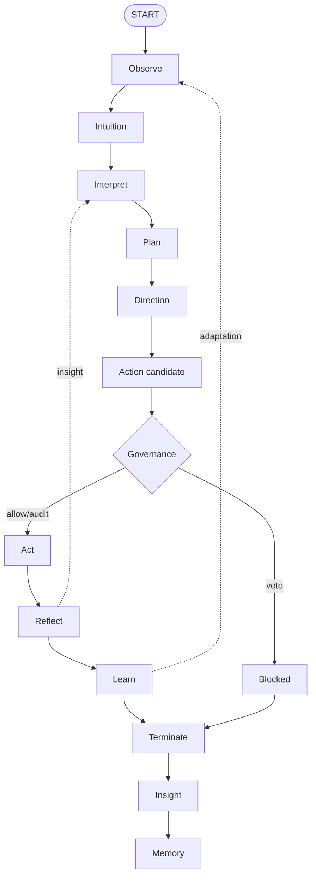
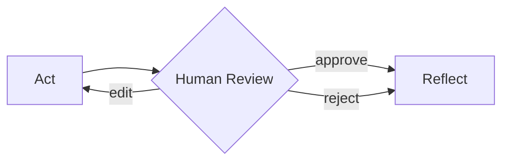

The cognitive loop is the core abstraction that makes agent reasoning explicit and auditable. Every Noēsis episode emits a sequence of observable phases.

## The phase sequence



The action-candidate phase describes the pending side effect before it reaches
the OS boundary. Governance then evaluates that candidate; if enforce mode vetoes
it, execution jumps to a blocked state and no `act` event is emitted. Each phase
has a specific purpose and produces structured events that form the episode
timeline.

<Info>
In **minimal mode**, Direction, Governance, and Insight may emit no events for faster execution. In **meta mode** (default), all faculties are active and the full phase sequence is observable.
</Info>

## Observe

The **observe** phase captures the raw input at the moment an episode starts.

**Purpose**: Record exactly what the agent was asked to do, with all context.

**What gets recorded**:
- Task text (the goal or prompt)
- Tags (metadata like environment, priority)
- Timestamp
- Initial context

**Example event**:

```json
{
  "phase": "observe",
  "payload": {
    "task": "Draft release notes for v1.2.0",
    "tags": {"priority": "high", "team": "platform"},
    "timestamp": "2024-01-15T10:30:00Z"
  },
  "metrics": {
    "duration_ms": 1
  }
}
```

**Why it matters**: You can confirm the exact scope the agent perceived, enabling accurate replay and debugging.

## Interpret

The **interpret** phase extracts signals and intent from the observed input.

**Purpose**: Summarize what the policy or intuition layer noticed before any plan is locked in.

**What gets recorded**:
- Signals (risks, opportunities, constraints)
- Intent classification
- Relevant context from memory
- Policy observations

**Example event**:

```json
{
  "phase": "interpret",
  "payload": {
    "signals": [
      {"type": "risk", "description": "Production deployment mentioned"},
      {"type": "constraint", "description": "Requires approval for releases"}
    ],
    "intent": "documentation_generation"
  },
  "caused_by": "observe_event_id",
  "metrics": {
    "duration_ms": 5
  }
}
```

**Why it matters**: You can see what influenced planning decisions, making the reasoning chain transparent.

## Plan

The **plan** phase decides what actions to take.

**Purpose**: Record the selected steps so you can compare intent versus action.

**What gets recorded**:
- Ordered steps with descriptions
- Tools or adapters to invoke
- Expected outcomes
- Confidence scores

**Example event**:

```json
{
  "phase": "plan",
  "payload": {
    "steps": [
      {"kind": "detect", "description": "Gather changelog entries", "status": "pending"},
      {"kind": "analyze", "description": "Categorize changes", "status": "pending"},
      {"kind": "act", "description": "Generate release notes", "status": "pending"},
      {"kind": "verify", "description": "Check formatting", "status": "pending"}
    ],
    "confidence": 0.85
  },
  "caused_by": "interpret_event_id",
  "metrics": {
    "duration_ms": 12
  }
}
```

**Step kinds**: The plan uses a controlled vocabulary for step types:

| Kind | Purpose |
| --- | --- |
| `detect` | Gather information |
| `analyze` | Process or categorize |
| `plan` | Sub-planning |
| `act` | Execute action |
| `verify` | Check results |
| `review` | Human review point |

**Why it matters**: You can audit what was planned and detect drift from the original intent.

## Act

The **act** phase executes the planned actions.

**Purpose**: Log every tool or adapter invocation with inputs and outcomes.

**What gets recorded**:
- Action identity (`action_id`, `kind`, `tool`)
- Input excerpt and status (`outcome`, `result_status`)
- Optional execution context (`step_id`, provenance, artifacts, `x-` extensions)
- Optional action-candidate link (`action_candidate_id`) for governed side effects
- Execution metrics

**Example event**:

```json
{
  "phase": "act",
  "payload": {
    "action_id": "act-1",
    "kind": "tool",
    "tool": "adapter:demo",
    "input_excerpt": "CHANGELOG.md",
    "outcome": "ok",
    "result_status": "ok",
    "step_id": "step-2",
    "provenance": {
      "source": "planner",
      "adapter_id": "adapter:demo"
    },
    "result_artifacts": [
      {"type": "doc", "uri": "artifact://demo/result"}
    ],
    "x-tool_draft_id": "draft-1"
  },
  "caused_by": "governance_event_id",
  "metrics": {
    "started_at": "2024-01-15T10:30:01Z",
    "completed_at": "2024-01-15T10:30:02Z",
    "duration_ms": 1200
  }
}
```

When governance/action-candidate flow is active, act events are causally linked
to governance through `caused_by`, include the accepted
`action_candidate_id`, and align state action timestamps with the act event
timestamp.

**Why it matters**: You get a measurable execution history instead of guesswork about what happened.

## Reflect

The **reflect** phase evaluates what actually happened.

**Purpose**: Compare outcomes against expectations and record the assessment.

**What gets recorded**:
- Success/failure status
- Reasons for the outcome
- Comparison to expected results
- Issues encountered

**Example event**:

```json
{
  "phase": "reflect",
  "payload": {
    "success": true,
    "reason": "All steps completed successfully",
    "expected_outcomes": ["release_notes_generated", "format_verified"],
    "actual_outcomes": ["release_notes_generated", "format_verified"],
    "issues": []
  },
  "caused_by": "act_event_id",
  "metrics": {
    "duration_ms": 3
  }
}
```

**Why it matters**: Dashboards can alert on failures, and you can analyze patterns in successes and failures.

## Learn

The **learn** phase captures updates for future runs.

**Purpose**: Record follow-up proposals so the next run can inherit lessons.

**What gets recorded**:
- Update proposals
- Scope of changes
- Memory updates
- Policy adjustment suggestions

**Example event**:

```json
{
  "phase": "learn",
  "payload": {
    "updates": [
      {"type": "memory", "key": "changelog_format", "value": "keep-a-changelog"},
      {"type": "hint", "content": "Include breaking changes section"}
    ],
    "scope": "session"
  },
  "caused_by": "reflect_event_id",
  "metrics": {
    "duration_ms": 2
  }
}
```

**Why it matters**: Episodes can improve over time without manual intervention.

## Insight

The **insight** phase computes KPIs and metrics from the episode.

**Purpose**: Generate structured metrics for dashboards, alerts, and analysis.

**What gets computed**:
- Plan adherence (how closely execution matched the plan)
- Veto count
- Tool coverage
- Latency percentiles
- Custom KPIs

**Example event**:

```json
{
  "phase": "insight",
  "payload": {
    "metrics": {
      "plan_adherence": 0.95,
      "veto_count": 0,
      "tool_coverage": 1.0,
      "branching_factor": 2
    },
    "kpis": {
      "success_rate": 1.0,
      "first_action_latency_ms": 150
    }
  },
  "caused_by": "learn_event_id"
}
```

**Why it matters**: Structured KPIs enable automated monitoring, alerting, and continuous improvement.

## Phase instrumentation

Since v0.7.0, every phase is instrumented with timing and lineage:

```json
{
  "id": "7d3d...f84",
  "phase": "plan",
  "payload": {...},
  "metrics": {
    "started_at": "2024-01-15T10:30:00.500Z",
    "completed_at": "2024-01-15T10:30:00.512Z",
    "duration_ms": 12.7
  },
  "caused_by": "5c12...0a9"
}
```

- `started_at` / `completed_at`: High-resolution timestamps
- `duration_ms`: Phase execution time
- `caused_by`: UUID linking to the causal parent event

This enables:
- Performance profiling per phase
- Causal chain reconstruction
- Bottleneck identification

## Direction

The **direction** phase applies policy-driven plan mutations (meta mode only).

**Purpose**: Allow policies to modify the plan before execution based on intuition signals.

**What gets recorded**:
- Directive ID (deterministic UUIDv5 for lineage)
- Status (applied, blocked, skipped)
- Diffs showing what changed
- Policy information

**Example event**:

```json
{
  "phase": "direction",
  "payload": {
    "schema_version": "1.2.0",
    "directive_id": "dir_abc123",
    "status": "applied",
    "reason": "heuristic-adjustment",
    "diff": [
      {
        "key": "plan.steps[0].description",
        "before": "Collect relevant context",
        "after": "Collect relevant context with safety review"
      }
    ],
    "applied": true,
    "policy_id": "SafetyPolicy",
    "policy_version": "1.0.0",
    "policy_kind": "rules"
  },
  "caused_by": "plan_event_id"
}
```

**Why it matters**: You can see exactly how policies modified the plan before execution.

## Action candidate

The **action candidate** phase records the pending side effect before governance
or execution.

**Purpose**: Preserve a deterministic, redaction-aware description of what would
cross the side-effect boundary.

**What gets recorded**:
- Stable candidate ID
- Side-effect kind and normalized payload
- State reference and `sha256:<64 lowercase hex>` state hash
- Redaction metadata
- Optional provenance and risk tags

**Example event**:

```json
{
  "phase": "action_candidate",
  "payload": {
    "schema_version": "action_candidate/1.0.0",
    "action_candidate_id": "8f5b5f4d-2d9a-5f1f-a5f7-6f20b8f0a4c8",
    "kind": "adapter",
    "payload": {
      "adapter_label": "adapter:core.minimal",
      "goal": "Draft release notes",
      "plan_step_id": "step-2"
    },
    "state_ref": "state.json",
    "state_hash": "sha256:aaaaaaaaaaaaaaaaaaaaaaaaaaaaaaaaaaaaaaaaaaaaaaaaaaaaaaaaaaaaaaaa",
    "redaction": {
      "mode": "hash_only",
      "policy_id": "redact.default",
      "policy_version": "1.0.0",
      "field_rules": {}
    },
    "provenance": {
      "plan_step_id": "step-2",
      "adapter": "adapter:core.minimal"
    }
  },
  "caused_by": "direction_event_id"
}
```

**Why it matters**: Governance and audit tools can inspect the exact proposed
side effect without relying on post-hoc `act` logs. If the candidate is vetoed
in enforce mode, no `act` event should reference its `action_candidate_id`.

## Governance

The **governance** phase is a critical gate that audits actions before execution (meta mode only).

**Purpose**: Enforce pre-action policies and provide audit trails for compliance.

**What gets recorded**:
- Governance ID (deterministic UUIDv5)
- Decision (allow, audit, veto)
- Rule that triggered the decision
- Confidence score
- Runtime mode, failure policy, enforcement flag, and evaluation errors when present

**Example event**:

```json
{
  "phase": "governance",
  "payload": {
    "schema_version": "1.1.0",
    "governance_id": "gov_def456",
    "decision_id": "dec_789",
    "decision": "allow",
    "rule_id": "rules.allow.default",
    "score": 0.95,
    "message": "Allowed by default policy",
    "policy_id": "governance.rules",
    "policy_version": "1.0.0",
    "policy_kind": "rules",
    "mode": "enforce",
    "failure_policy": "fail_closed",
    "enforced": false
  },
  "caused_by": "action_candidate_event_id"
}
```

**Governance decisions**:

| Decision | Effect |
| --- | --- |
| `allow` | Action proceeds normally |
| `audit` | Action proceeds, flagged for review |
| `veto` | In enforce mode, action is blocked and the run terminates or pauses; in audit mode, the veto is recorded and execution may proceed |

**Why it matters**: The PreActGovernor ensures dangerous actions are blocked
before they execute, with full audit trails. In audit mode a veto is recorded but
execution may proceed; in enforce mode a veto emits a blocked direction and no
`act` event for that candidate.

## Event order invariant

Events follow this order in **meta mode**:

```
observe → intuition → interpret → plan → direction → action_candidate → governance → act+ → reflect → learn → terminate → insight → memory
```

An enforced governance veto blocks execution and emits a blocked-direction trace
instead of `act`:

```
... → direction(status="blocked") → action_candidate → governance(decision="veto") → terminate
```

If `governance_pause_on_veto=true`, `run.interrupt → run.checkpoint` replaces
`terminate` and the run remains unsealed until continuation.

In **minimal mode**, Direction, Governance, and Insight may emit no events:

```
observe → intuition → interpret → plan → act+ → reflect → learn? → terminate → memory
```

<Info>
**Invariant**: Even on an error or veto, Noēsis emits an ordered trace. Terminal
runs get summary and final artifacts; paused vetoes keep checkpoint artifacts
until continuation.
</Info>

This means:
- Failed episodes still have complete timelines
- Vetoed episodes record why they were blocked (governance decision recorded)
- Errors are captured in the reflect phase
- You can always inspect what happened

## Feedback loops

The diagram shows two feedback paths:

1. **Insight → Interpret**: Reflections from one cycle can inform the next interpretation
2. **Learn → Observe**: Adaptations can modify how future observations are processed

These enable:
- Progressive refinement within an episode
- Cross-episode learning
- Policy adaptation over time

## Human in the loop

Human review slots naturally between Act and Reflect:



Policies can flag operations for human approval, pausing the loop until a decision is made.

## Reading the timeline

Use the CLI to inspect the timeline:

```bash
# All events
noesis events ep_abc123

# Filter by phase
noesis events ep_abc123 --phase plan

# As JSON for scripting
noesis events ep_abc123 -j | jq '.[] | select(.phase == "act")'
```

Or in Python:

```python
import noesis as ns

events = list(ns.events.read(episode_id))

# Filter phases
plan_events = [e for e in events if e["phase"] == "plan"]
act_events = [e for e in events if e["phase"] == "act"]

# Reconstruct causal chain
def get_causal_chain(events, event_id):
    chain = []
    current = next((e for e in events if e["id"] == event_id), None)
    while current:
        chain.append(current)
        current = next((e for e in events if e["id"] == current.get("caused_by")), None)
    return chain
```

## Next steps

<CardGroup cols={2}>
  <Card title="Faculties" icon="brain" href="/explanation/faculties">
    How Intuition, Direction, and Insight work.
  </Card>
  <Card title="Events reference" icon="list" href="/reference/events">
    Complete event schema documentation.
  </Card>
</CardGroup>
