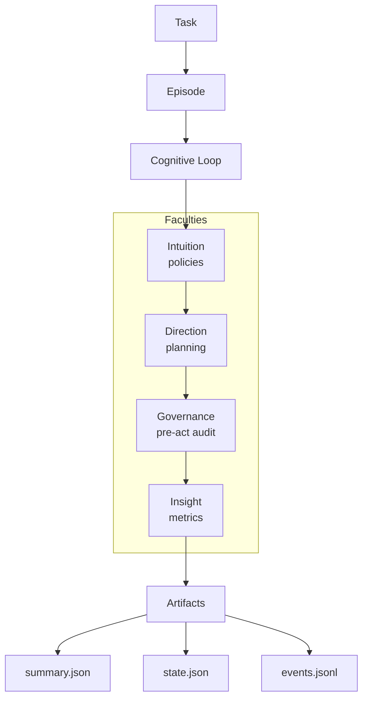

This page explains the core concepts you'll encounter when working with Noēsis. Understanding these will help you make the most of the framework.

## Episodes

An **episode** is the fundamental unit of execution in Noēsis. Every time you run a task, you create an episode with a unique identifier.

```python
import noesis as ns

episode_id = ns.run("Draft release notes")
# episode_id = "ep_01JH6Z2V9Q2K6Y6N0QZ7K2QW8C"
```

### Episode lifecycle

A run either **seals** or **pauses**:

```
running → sealed (final.json + manifest.json)
        → paused (checkpoint, unsealed until resume_run)
```

| Outcome | Meaning |
| --- | --- |
| Sealed terminal | `final.json` exists. Lifecycle APIs raise `RunSealedError`. |
| Paused / interrupted | Checkpoint written; no `final.json` yet. Continue with `ns.resume_run(...)`. |
| Enforce veto (default) | Side effect is blocked and the run terminates (`governance_pause_on_veto=False`). |
| Enforce veto (pause) | Side effect is blocked, then `run.interrupt` + `run.checkpoint` (`governance_pause_on_veto=True`). |

### Episode IDs

Episode IDs follow the format `ep_<ULID>` (26 Crockford base32 characters after the prefix). The ULID encodes a millisecond timestamp plus entropy so IDs sort chronologically.

Reproducibility uses the **per-call** `seed=` argument. `seed` is not a `ns.set()` config key.

```python
import noesis as ns

ep1 = ns.run("task", seed=42)
ep2 = ns.run("task", seed=42)
# Matching seed + frozen inputs → matching behavior (external tools/LLMs may still vary)
```

## The cognitive loop

Every episode emits a sequence of **phases** that make reasoning explicit:

```
observe → intuition → interpret → plan → direction → governance → act → reflect → learn → terminate → insight → memory
```

<Info>
In **meta mode** (default), all faculties are active and may emit phases. In **minimal mode**, Direction, Governance, and Insight still exist but may emit no events for faster execution.
</Info>

| Phase | Purpose | What gets recorded |
| --- | --- | --- |
| **observe** | Capture raw task and context | Task text, tags, timestamp |
| **intuition** | Policy guidance | Hints, interventions, veto signals |
| **interpret** | Extract signals and intent | Signals, risks, constraints |
| **plan** | Decide what to do | Steps, tools to use |
| **direction** | Apply policy mutations | Directives, diffs |
| **governance** | Pre-action audit | Allow/audit/veto decisions |
| **act** | Execute the plan | Tool calls, adapter results |
| **reflect** | Evaluate outcomes | Success/failure, reasons |
| **learn** | Update for future runs | Proposals, adaptations |
| **terminate** | Close the episode | Final status and message |
| **insight** | Compute KPIs | Metrics, plan adherence |
| **memory** | Persist context | Memory updates/port status |

See the [cognitive loop explanation](/explanation/cognitive-loop) for a deeper dive.

## Faculties

Noēsis organizes capabilities into four **faculties** that execute in a canonical order. Faculties exist even when they emit nothing.

```
Intuition → Direction → Governance → Insight
```

### Intuition

**Intuition** provides policy-driven guidance during interpretation. It observes state and emits events.

```python
class MyPolicy(ns.DirectedIntuition):
    def advise(self, state: dict):
        if "dangerous" in state["task"]:
            return self.veto(advice="Blocked dangerous operation")
        return None
```

**Key types**: `IntuitionEvent`, `DirectedIntuition`, `HeuristicIntuition`, `LLMIntuition`

**Actions**:
- `hint()`: Advisory guidance (confidence: 0.5)
- `intervene()`: Modify state via patch (confidence: 0.6)
- `veto()`: Block execution (confidence: 0.8)

### Direction

**Direction** handles plan mutations through versioned directives.

**Key types**: `PlannerDirective`, `DirectiveDiff`, `DirectiveStatus`

**Directive kinds**: `HINT`, `INTERVENTION`, `VETO`

**Directive statuses**: `APPLIED`, `SKIPPED`, `BLOCKED`

### Governance

**Governance** is the pre-action audit layer with the `PreActGovernor`. It is the gate that enforces approvals and can veto before tools execute.

**Key types**: `GovernanceResult`, `GovernanceDecision`, `PreActGovernor`

**Decisions**:
- `ALLOW`: Action proceeds normally
- `AUDIT`: Action proceeds, flagged for review
- `VETO`: Action blocked entirely

**Use it for**: human-in-the-loop approvals, safety allowlists/blocklists, “two-person rule” for destructive tools, and recording audit reasons right before execution.

### Insight

**Insight** computes metrics from episode traces during finalization.

**Key types**: `InsightMetrics`, `compute_metrics`, `build_insight_metrics`

**Metrics**: `veto_count`, `branching_factor`, `plan_adherence`, `plan_revisions`, `tool_coverage`, `phase_ms`

## Artifacts

Every episode produces structured **artifacts** that capture the full cognitive trace:

```
.noesis/episodes/
  ep_01JH6Z2V9Q2K6Y6N0QZ7K2QW8C/
    summary.json         # metrics and outcomes
    state.json           # cognitive state
    events.jsonl         # timeline
    final.json           # terminal seal
    manifest.json        # integrity checksums
    learn.jsonl          # learning signals (optional)
```

### summary.json

The summary captures episode outcomes, flags, metrics, and insight:

```json
{
  "schema_version": "1.3.0",
  "episode_id": "ep_01JH6Z2V9Q2K6Y6N0QZ7K2QW8C",
  "task": "Draft release notes",
  "seed": 42,
  "started_at": "2024-01-15T10:30:00Z",
  "duration_sec": 5.12,
  "flags": {
    "intuition": true,
    "mode": "meta",
    "using": "langgraph",
    "direction": {
      "applied": 1,
      "vetoed": 0,
      "policy": "SafetyPolicy@1.0",
      "threshold": 0.75,
      "last_diff": [
        "plan.steps[0].params.limit: null → 100"
      ]
    }
  },
  "ports": {
    "model": "openai:gpt-4o-mini"
  },
  "agents_config_hash": "sha256:9f7d...",
  "answer": {},
  "metrics": {
    "success": 1,
    "plan_count": 2,
    "act_count": 3,
    "veto_count": 0
  },
  "insight": {
    "plan_adherence": 0.95,
    "tool_coverage": 1.0
  },
  "tags": {
    "team": "platform"
  },
  "manifest": {
    "path": "manifest.json"
  }
}
```

### state.json

The state captures the cognitive context:

```json
{
  "version": "1.0",
  "episode": {
    "id": "ep_01JH6Z2V9Q2K6Y6N0QZ7K2QW8C",
    "adapter": "baseline"
  },
  "goal": {
    "task": "Draft release notes",
    "context": {}
  },
  "plan": {
    "steps": [
      {"kind": "detect", "description": "Gather changelog entries"},
      {"kind": "act", "description": "Generate summary"}
    ]
  },
  "outcomes": {
    "status": "ok",
    "actions": []
  }
}
```

### events.jsonl

The event timeline records every phase:

```json
{"phase": "observe", "payload": {"task": "Draft release notes"}, "metrics": {"started_at": "...", "completed_at": "...", "duration_ms": 1.2}}
{"phase": "interpret", "payload": {"signals": []}, "caused_by": "abc...", "metrics": {"started_at": "...", "completed_at": "...", "duration_ms": 2.3}}
{"phase": "plan", "payload": {"steps": [...]}, "caused_by": "def...", "metrics": {"started_at": "...", "completed_at": "...", "duration_ms": 1.0}}
{"phase": "act", "payload": {"tool": "generator"}, "caused_by": "ghi...", "metrics": {"started_at": "...", "completed_at": "...", "duration_ms": 4.8}}
{"phase": "reflect", "payload": {"success": true}, "caused_by": "jkl...", "metrics": {"started_at": "...", "completed_at": "...", "duration_ms": 0.6}}
```

### manifest.json

The manifest provides integrity verification:

```json
{
  "schema_version": "manifest/1.0",
  "episode_id": "ep_01JH6Z2V9Q2K6Y6N0QZ7K2QW8C",
  "created_at": "2024-01-15T10:30:05Z",
  "files": [
    {"name": "summary.json", "sha256": "sha256:abc123...", "size_bytes": 1234, "kind": "summary"},
    {"name": "events.jsonl", "sha256": "sha256:def456...", "size_bytes": 5678, "kind": "events"}
  ]
}
```

## Adapters

**Adapters** connect Noēsis to your existing agent runtimes. They're simply callables that Noēsis wraps with cognition:

```python
import noesis as ns

# Plain function adapter
def my_adapter(task: str) -> dict:
    return {"result": task.upper()}

# LangGraph adapter
def langgraph_adapter(task: str) -> dict:
    return graph.invoke({"task": task})

# Use with Noēsis
ns.solve("task", using=my_adapter)
```

Noēsis doesn't replace your runtime—it makes it observable.

## Policies

**Policies** are Python classes that implement guardrails. They extend `DirectedIntuition` and implement the `advise` method:

```python
import noesis as ns

class SafetyPolicy(ns.DirectedIntuition):
    __version__ = "1.0"
    
    def advise(self, state: dict):
        # Return None to allow, or use hint/intervene/veto
        return None
```

Policies are:
- **Testable**: Pure Python, no async or threading requirements
- **Versioned**: Track policy evolution in event logs
- **Composable**: Chain multiple policies together

## Configuration

Noēsis is configured through multiple sources:

| Source | Example | Precedence |
| --- | --- | --- |
| `ns.set()` | `ns.set(planner_mode="meta")` | Highest |
| Environment | `NOESIS_PLANNER=meta` | Medium |
| `noesis.toml` | `planner_mode = "meta"` | Lowest |

Key configuration options:

- `runs_dir`: Where artifacts are stored (default `.noesis/episodes`)
- `planner_mode`: `meta` (full governance) or `minimal`
- `governance_mode` / `governance_pause_on_veto`: pre-act audit and pause-on-veto
- Per-call `seed=`, `tags=`, `process=`, `verify=` on `ns.run` / `ns.solve` (not `ns.set()` keys)

There is no `label` config key. Group runs with `process="rollout"` / `--process rollout`. Process identity is `sha256(workspace|name)[:12]` and lives under `.noesis/processes/`, not as a nested episode folder.

## Mental model

Here's how the pieces fit together:



1. A **task** creates an **episode**
2. The episode runs through the **cognitive loop**
3. **Faculties** (Intuition, Direction, Governance, Insight) process each phase
4. **Artifacts** capture everything for replay and analysis

## Next steps

<CardGroup cols={2}>
  <Card title="Cognitive loop" icon="arrows-rotate" href="/explanation/cognitive-loop">
    Deep dive into the observe → learn phases.
  </Card>
  <Card title="Faculties" icon="brain" href="/explanation/faculties">
    Understand Intuition, Direction, Governance, and Insight.
  </Card>
  <Card title="Artifacts" icon="files" href="/explanation/artifacts">
    Learn about the files Noēsis produces.
  </Card>
  <Card title="Quickstart" icon="rocket" href="/quickstart">
    Get hands-on with your first episode.
  </Card>
</CardGroup>
