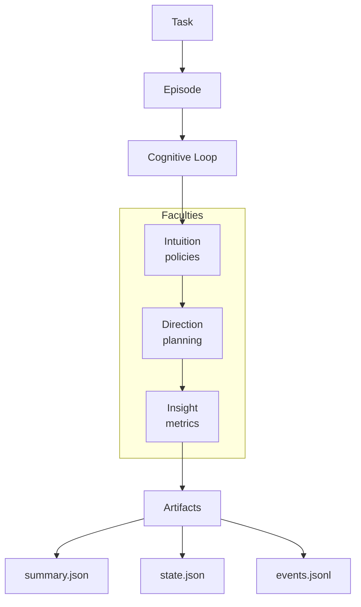

This page explains the core concepts you'll encounter when working with Noēsis. Understanding these will help you make the most of the framework.

## Episodes

An **episode** is the fundamental unit of execution in Noēsis. Every time you run a task, you create an episode with a unique identifier.

```python
import noesis as ns

episode_id = ns.run("Draft release notes")
# episode_id = "ep_2024_abc123_s0"
```

### Episode lifecycle

Episodes progress through a defined lifecycle:

```
queued → running → completed | errored | vetoed
```

| Status | Meaning |
| --- | --- |
| `queued` | Episode created, waiting to start |
| `running` | Cognitive loop in progress |
| `completed` | All phases finished successfully |
| `errored` | An exception occurred during execution |
| `vetoed` | A policy blocked execution |

### Episode IDs

Episode IDs follow the format `ep_<timestamp>_<hash>_s<seed>`:

- `ep_` prefix identifies it as an episode
- `<timestamp>` provides chronological ordering
- `<hash>` ensures uniqueness
- `s<seed>` enables reproducible runs with the same seed

```python
import noesis as ns

# Reproducible runs with the same seed
ns.set(seed=42)
ep1 = ns.run("task")

ns.set(seed=42)
ep2 = ns.run("task")
# ep1 and ep2 will have matching behavior
```

## The cognitive loop

Every episode flows through a sequence of **nine phases** that make reasoning explicit:

```
Observe → Interpret → Plan → Direction → Governance → Act → Reflect → Learn → Insight
```

<Info>
In **meta mode** (default), all nine phases execute. In **minimal mode**, Direction, Governance, and Insight are skipped for faster execution.
</Info>

| Phase | Purpose | What gets recorded |
| --- | --- | --- |
| **Observe** | Capture raw task and context | Task text, tags, timestamp |
| **Interpret** | Extract signals and intent | Signals, risks, constraints |
| **Plan** | Decide what to do | Steps, tools to use |
| **Direction** | Apply policy mutations | Directives, diffs |
| **Governance** | Pre-action audit | Allow/audit/veto decisions |
| **Act** | Execute the plan | Tool calls, adapter results |
| **Reflect** | Evaluate outcomes | Success/failure, reasons |
| **Learn** | Update for future runs | Proposals, adaptations |
| **Insight** | Compute KPIs | Metrics, plan adherence |

See the [cognitive loop explanation](/explanation/cognitive-loop) for a deeper dive.

## Faculties

Noēsis organizes capabilities into four **faculties** that execute in a canonical order:

```
observe → interpret → plan → direction → governance.pre_act → act → reflect → finalize
```

### Intuition

**Intuition** provides policy-driven guidance during interpretation. It observes state and emits events.

```python
class MyPolicy(ns.DirectedIntuition):
    def advise(self, state: dict):
        if "dangerous" in state["task"]:
            return self.veto(advice="Blocked dangerous operation")
        return None
```

**Key types**: `IntuitionEvent`, `DirectedIntuition`, `HeuristicIntuition`, `LLMIntuition`

**Actions**:
- `hint()`: Advisory guidance (confidence: 0.5)
- `intervene()`: Modify state via patch (confidence: 0.6)
- `veto()`: Block execution (confidence: 0.8)

### Direction

**Direction** handles plan mutations through versioned directives.

**Key types**: `PlannerDirective`, `DirectiveDiff`, `DirectiveStatus`

**Directive kinds**: `HINT`, `INTERVENTION`, `VETO`

**Directive statuses**: `APPLIED`, `SKIPPED`, `BLOCKED`

### Governance

**Governance** is the pre-action audit layer with the `PreActGovernor`.

**Key types**: `GovernanceResult`, `GovernanceDecision`, `PreActGovernor`

**Decisions**:
- `ALLOW`: Action proceeds normally
- `AUDIT`: Action proceeds, flagged for review
- `VETO`: Action blocked entirely

### Insight

**Insight** computes metrics from episode traces during finalization.

**Key types**: `InsightMetrics`, `compute_metrics`, `build_insight_metrics`

**Metrics**: `veto_count`, `branching_factor`, `plan_adherence`, `plan_revisions`, `tool_coverage`, `phase_ms`

## Artifacts

Every episode produces structured **artifacts** that capture the full cognitive trace:

```
runs/
  demo/                    # label
    ep_2024_abc123_s0/     # episode
      summary.json         # metrics and outcomes
      state.json           # cognitive state
      events.jsonl         # timeline
      manifest.json        # integrity checksums
      learn.jsonl          # learning signals (optional)
```

### summary.json

The summary captures episode outcomes and metrics:

```json
{
  "schema_version": "1.2.0",
  "episode_id": "ep_2024_abc123_s0",
  "task": "Draft release notes",
  "flags": {
    "intuition": true,
    "mode": "meta"
  },
  "metrics": {
    "success": 1,
    "plan_count": 2,
    "act_count": 3,
    "veto_count": 0
  }
}
```

### state.json

The state captures the cognitive context:

```json
{
  "version": "1.0",
  "episode": {
    "id": "ep_2024_abc123_s0",
    "adapter": "baseline"
  },
  "goal": {
    "task": "Draft release notes",
    "context": {}
  },
  "plan": {
    "steps": [
      {"kind": "detect", "description": "Gather changelog entries"},
      {"kind": "act", "description": "Generate summary"}
    ]
  },
  "outcomes": {
    "status": "ok",
    "actions": []
  }
}
```

### events.jsonl

The event timeline records every phase:

```json
{"phase": "observe", "payload": {"task": "Draft release notes"}, "metrics": {"duration_ms": 1}}
{"phase": "interpret", "payload": {"signals": []}, "caused_by": "abc..."}
{"phase": "plan", "payload": {"steps": [...]}, "caused_by": "def..."}
{"phase": "act", "payload": {"tool": "generator"}, "caused_by": "ghi..."}
{"phase": "reflect", "payload": {"success": true}, "caused_by": "jkl..."}
```

### manifest.json

The manifest provides integrity verification:

```json
{
  "files": {
    "summary.json": {
      "sha256": "abc123...",
      "size": 1234
    },
    "events.jsonl": {
      "sha256": "def456...",
      "size": 5678
    }
  }
}
```

## Adapters

**Adapters** connect Noēsis to your existing agent runtimes. They're simply callables that Noēsis wraps with cognition:

```python
import noesis as ns

# Plain function adapter
def my_adapter(task: str) -> dict:
    return {"result": task.upper()}

# LangGraph adapter
def langgraph_adapter(task: str) -> dict:
    return graph.invoke({"task": task})

# Use with Noēsis
ns.solve("task", using=my_adapter)
```

Noēsis doesn't replace your runtime—it makes it observable.

## Policies

**Policies** are Python classes that implement guardrails. They extend `DirectedIntuition` and implement the `advise` method:

```python
import noesis as ns

class SafetyPolicy(ns.DirectedIntuition):
    __version__ = "1.0"
    
    def advise(self, state: dict):
        # Return None to allow, or use hint/intervene/veto
        return None
```

Policies are:
- **Testable**: Pure Python, no async or threading requirements
- **Versioned**: Track policy evolution in event logs
- **Composable**: Chain multiple policies together

## Configuration

Noēsis is configured through multiple sources:

| Source | Example | Precedence |
| --- | --- | --- |
| `ns.set()` | `ns.set(planner_mode="meta")` | Highest |
| Environment | `NOESIS_PLANNER=meta` | Medium |
| `noesis.toml` | `planner_mode = "meta"` | Lowest |

Key configuration options:

- `runs_dir`: Where artifacts are stored
- `planner_mode`: `meta` (full governance) or `minimal`
- `seed`: For reproducible episodes
- `label`: Subdirectory name for organizing runs

## Mental model

Here's how the pieces fit together:



1. A **task** creates an **episode**
2. The episode runs through the **cognitive loop**
3. **Faculties** (Intuition, Direction, Insight) process each phase
4. **Artifacts** capture everything for replay and analysis

## Next steps

<CardGroup cols={2}>
  <Card title="Cognitive loop" icon="arrows-rotate" href="/explanation/cognitive-loop">
    Deep dive into the observe → learn phases.
  </Card>
  <Card title="Faculties" icon="brain" href="/explanation/faculties">
    Understand Intuition, Direction, and Insight.
  </Card>
  <Card title="Artifacts" icon="files" href="/explanation/artifacts">
    Learn about the files Noēsis produces.
  </Card>
  <Card title="Quickstart" icon="rocket" href="/quickstart">
    Get hands-on with your first episode.
  </Card>
</CardGroup>
