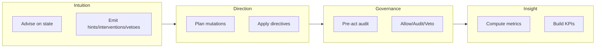

Noēsis separates **faculties** (capabilities/subsystems in the runtime) from **phases** (observable events emitted into the episode trace).

- **Faculties** describe *what* kind of cognition runs: **Intuition**, **Direction**, **Governance**, **Insight** (other runtime faculties like **Memory** can participate too).
- **Phases** describe *what* gets recorded: `observe → intuition → interpret → plan → direction → governance → act → reflect → learn → terminate → insight → memory`

Faculties exist even when they emit nothing; a faculty can be active and still produce no events for a given episode.

<Info>
Most users configure faculties via `noesis.set()` and `noesis.run()`, then observe results in artifacts (`events.jsonl`, `summary.json`). Python imports are only needed for writing custom policies—see [Advanced: Writing policies](#advanced-writing-policies).
</Info>

## Cognitive loop hook order

The runtime emits phases in a canonical order:

```
observe → intuition → interpret → plan → direction → governance → act → reflect → learn → terminate → insight → memory
```

<Info>
Hook ordering is enforced by `validate_hook_sequence()`. Any violation raises an error.
</Info>

## Veto semantics (canonical)

A **veto** is a fail-closed stop before action execution:

- Governance emits the veto decision event; the runtime emits a single `terminate` event with `status="vetoed"`.
- No `act` events are emitted on veto paths.
- Failure policy decides how governance exceptions resolve (e.g., enforce-veto).
- `veto_count` is computed from governance decisions where `decision="veto"` (not from terminate status) to avoid double-counting.

## Overview



| Faculty | Role | Phase(s) | Artifact keys |
| --- | --- | --- | --- |
| **Intuition** | Policy guidance | intuition | `phase="intuition"` events |
| **Direction** | Plan mutations | direction | `phase="direction"` events |
| **Governance** | Pre-act audit | governance | `phase="governance"` events |
| **Insight** | Metrics computation | insight | `summary.json` metrics |

---

## Intuition

**Intuition** provides policy-driven guidance during the interpret phase. It observes episode state and emits events that can hint, intervene, or veto.

### Configuration

```python
import noesis as ns

# Configure via noesis.set()
ns.set(intuition_mode="advisory")  # advisory | interventive | hybrid

# Or pass a policy directly
ns.run(task="...", intuition=my_policy)
```

### IntuitionEvent (artifact schema)

Intuition events appear in `events.jsonl` with `phase="intuition"`:

```json
{
  "phase": "intuition",
  "payload": {
    "kind": "intervention",
    "advice": "Added safety bounds",
    "confidence": 0.8,
    "policy_id": "SafetyPolicy",
    "policy_version": "1.0.0",
    "policy_kind": "rules",
    "rationale": "Unbounded query detected",
    "patch": {"limit": 100},
    "target": "input",
    "scope": "episode",
    "blocking": false
  }
}
```

| Field | Description |
| --- | --- |
| `kind` | `hint` \| `intervention` \| `veto` |
| `confidence` | 0.0 – 1.0 |
| `patch` | State modifications (for interventions) |
| `blocking` | `true` for vetoes |

### Intuition modes

| Mode | Behavior |
| --- | --- |
| `advisory` | Hints only, non-blocking |
| `interventive` | Can modify state |
| `hybrid` | Context-dependent |

---

## Direction

**Direction** handles plan mutations through versioned directives. It runs after `plan`, before `governance`, and does not perform vetoes—fail-closed gates live in Governance.

### PlannerDirective (artifact schema)

Direction events appear in `events.jsonl` with `phase="direction"`:

```json
{
  "phase": "direction",
  "payload": {
    "schema_version": "1.0.0",
    "steps": ["detect:Gather data", "act:Process"],
    "status": "applied",
    "reason": "Added safety bounds",
    "diff": [{"key": "plan.steps[0].params.limit", "before": null, "after": 100}],
    "applied": true,
    "policy_id": "SafetyPolicy",
    "policy_version": "1.0.0",
    "policy_kind": "rules",
    "directive_id": "dir-abc123..."
  }
}
```

### DirectiveStatus

| Status | Meaning |
| --- | --- |
| `applied` | Directive was applied |
| `skipped` | Directive was skipped |
| `blocked` | Directive rejected/failed (does not stop execution) |

### DirectiveKind

| Kind | Meaning |
| --- | --- |
| `hint` | Advisory, no state change |
| `intervention` | Modifies plan/input |

### Deterministic IDs

Directive IDs are computed from content for reproducible lineage.

---

## Governance

**Governance** is the pre-action audit layer that evaluates proposed actions before execution. It operates in the `governance` phase.

### Governed side effects (pre-act gating)

`ns.governed_act(...)` is the operating-system boundary for side effects. It emits:

- `action_candidate → governance → act`
- or, on enforced veto: `action_candidate → governance → terminate` (no `act`)

```python
import noesis as ns
from noesis.exceptions import NoesisVeto

def run_shell(*, command: str, cwd: str | None = None, timeout_ms: int | None = None):
    return {"stdout": "ok", "stderr": "", "exit_code": 0, "command": command}

ns.set(shell_executor=run_shell)

try:
    result = ns.governed_act(
        goal="List repository files",
        kind="shell",
        payload={
            "command": "ls -a",
            "cwd": ".",
            "timeout_ms": 2000,
        },
    )
    print(result)
except NoesisVeto as veto:
    # Raised only when governance is enforcing and the action is vetoed.
    print(f"Blocked by governance: {veto.advice}")
```

### Configuration

```python
import noesis as ns

# Configure via noesis.set()
ns.set(governance_mode="enforce")  # off | audit | enforce
ns.set(governance_failure_policy="fail_closed")  # fail_open | fail_closed

# Or supply a custom governor
ns.run(task="...", governance_policy=my_governor)
```

### GovernanceResult (artifact schema)

Governance events appear in `events.jsonl` with `phase="governance"`:

```json
{
  "phase": "governance",
  "payload": {
    "decision": "veto",
    "rule_id": "rules.veto.protected",
    "score": 1.0,
    "message": "Task blocked by governance policy",
    "policy_id": "governance.rules",
    "policy_version": "1.0.0",
    "policy_kind": "rules",
    "mode": "enforce",
    "enforced": true
  }
}
```

<Info>
Event stream convention: governance events keep `phase="governance"`; sub-hooks (e.g., `pre_act`) are carried inside the payload. This keeps the phase enum stable.
</Info>

### GovernanceDecision

| Decision | Effect |
| --- | --- |
| `allow` | Action proceeds normally |
| `audit` | Action proceeds, flagged for review |
| `veto` | Action blocked entirely |

### Terminate on veto

When a veto is issued, the runtime emits a terminate event:

```json
{"phase":"runtime","payload":{"kind":"terminate","status":"vetoed","message":"Blocked by governance"}}
```

_See `events.v1` for the canonical terminate payload._

### Built-in rules

| Rule ID | Trigger | Decision |
| --- | --- | --- |
| `rules.veto.danger` | "danger" in goal/steps | `VETO` |
| `rules.veto.protected` | "veto", "destroy", "shutdown", "wipe" | `VETO` |
| `rules.audit.sensitive` | "write", "delete", "drop" | `AUDIT` |
| `rules.allow.default` | No matches | `ALLOW` |

---

## Insight

**Insight** computes metrics from episode traces during the insight emission.

### InsightMetrics (artifact schema)

Metrics appear in `summary.json`:

```json
{
  "metrics": {
    "phase_ms": {"observe": 5, "interpret": 12, "plan": 150, "act": 2000, "reflect": 10},
    "veto_count": 0,
    "branching_factor": 2.0,
    "plan_adherence": 0.95,
    "success": true,
    "plan_revisions": 1,
    "tool_coverage": 3.0
  }
}
```

### InsightMetrics fields

| Field | Type | Description |
| --- | --- | --- |
| `phase_ms` | `dict[str, int]` | Duration per phase in milliseconds (optional) |
| `veto_count` | `int` | Number of governance vetoes issued (canonical fail-closed) |
| `branching_factor` | `float` | Count of direction events |
| `plan_adherence` | `float` | Executed steps / planned steps (0-1) |
| `success` | `bool` | Whether episode succeeded (boolean for artifacts) |
| `plan_revisions` | `int` | Number of applied directives |
| `tool_coverage` | `float` | Number of unique tools used |

### Computed roll-ups

When computing analytics from events, the insight faculty produces these roll-ups:

| Metric | Shape | Notes |
| --- | --- | --- |
| `success` | `bool` | From artifact |
| `success_score` | `int` (0/1) | Numeric roll-up |
| `plan_count` | `int` | Non-synthetic `plan` events |
| `act_count` | `int` | Non-synthetic `act` events |
| `direction_applied` | `int` | Directives with `applied=true` |
| `direction_blocked` | `int` | Directives with `status="blocked"` (not a veto) |
| `veto_count` | `int` | Governance veto decisions |

---

## Faculty boundaries

Each faculty has clear responsibilities:

<Warning>
**Intuition** observes and advises—it should never execute actions directly.
</Warning>

<Warning>
**Direction** handles plan mutations—it should never evaluate outcomes.
</Warning>

<Warning>
**Governance** audits pre-action—it should never modify plans.
</Warning>

<Warning>
**Insight** computes metrics—it should never modify state or plans.
</Warning>

---

## Advanced: Writing policies

<Info>
This section is for users writing custom intuition policies or custom governors. Most users can skip this.
</Info>

### DirectedIntuition

To write a custom policy, extend `DirectedIntuition`:

```python
from noesis.direction import DirectedIntuition
from noesis.intuition import IntuitionEvent

class SafetyPolicy(DirectedIntuition):
    """Custom policy with hint, intervene, and veto methods."""
    
    def advise(self, state: dict) -> IntuitionEvent | None:
        task = state.get("task", "").lower()
        
        # Veto dangerous operations
        if "drop table" in task:
            return self.veto(
                advice="Blocked: destructive SQL operation",
                confidence=0.95,
                rationale="DROP TABLE requires manual approval",
            )
        
        # Intervene to add safety bounds
        if "select" in task and "limit" not in task:
            return self.intervene(
                advice="Added LIMIT 1000",
                patch={"task": f"{task} LIMIT 1000"},
                confidence=0.8,
            )
        
        return None
```

Then pass it to `noesis.run()`:

```python
import noesis as ns

ns.run(task="...", intuition=SafetyPolicy())
```

### DirectedIntuition methods

| Method | Effect | Default confidence |
| --- | --- | --- |
| `hint()` | Advisory guidance, non-blocking | 0.5 |
| `intervene()` | Modifies state via `patch` | 0.6 |
| `veto()` | Blocks execution, sets `blocking=True` | 0.8 |

### Parsing artifact payloads

If you need to parse artifact payloads programmatically:

```python
from noesis.direction import DirectiveKind, DirectiveStatus
from noesis.governance import GovernanceDecision
from noesis.insight import compute_metrics

# Parse direction event
if payload["status"] == DirectiveStatus.BLOCKED:
    print("Directive was blocked")

# Compute metrics from events
metrics = compute_metrics(summary={...}, events=[...])
print(metrics["veto_count"])
```

---

## Next steps

<CardGroup cols={2}>
  <Card title="Write policies" icon="pen" href="/guides/write-policies">
    Implement Intuition with custom policies.
  </Card>
  <Card title="Configure governance" icon="shield" href="/guides/configure-planner-modes">
    Control Direction and Governance behavior.
  </Card>
  <Card title="Export metrics" icon="chart-bar" href="/guides/export-metrics">
    Use Insight metrics in dashboards.
  </Card>
  <Card title="Cognitive loop" icon="arrows-rotate" href="/explanation/cognitive-loop">
    Understanding the full execution flow.
  </Card>
</CardGroup>
