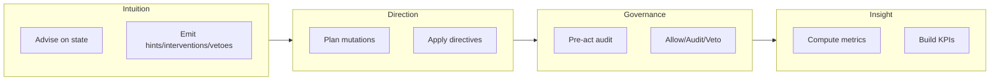

Noēsis organizes agent cognition into four **faculties** that operate at different points in the cognitive loop. Each faculty is a pure domain entity—free of side effects and infrastructure dependencies.

## Faculty hook order

The faculties execute in a canonical order:

```
observe → interpret → plan → direction → governance.pre_act → act → reflect → finalize
```

<Info>
This ordering is enforced by `validate_hook_sequence()` in the runtime. Any violation raises an error.
</Info>

## Overview



| Faculty | Role | Phases | Key types |
| --- | --- | --- | --- |
| **Intuition** | Policy guidance | interpret | `IntuitionEvent`, `DirectedIntuition` |
| **Direction** | Plan mutations | direction | `PlannerDirective`, `DirectiveDiff` |
| **Governance** | Pre-act audit | governance.pre_act | `GovernanceResult`, `PreActGovernor` |
| **Insight** | Metrics computation | finalize | `InsightMetrics`, `compute_metrics` |

---

## Intuition

**Intuition** provides policy-driven guidance during the interpret phase. It observes episode state and emits events that can hint, intervene, or veto.

### Intuition modes

```python
from noesis.domain.faculties import IntuitionMode

class IntuitionMode(str, Enum):
    ADVISORY = "advisory"       # Hints only, non-blocking
    INTERVENTIVE = "interventive"  # Can modify state
    HYBRID = "hybrid"           # Context-dependent
```

### IntuitionEvent

The core data structure emitted by intuition policies:

```python
from noesis.domain.faculties import IntuitionEvent

event = IntuitionEvent(
    kind="intervention",          # hint | intervention | veto
    advice="Added safety bounds",
    confidence=0.8,               # 0.0 - 1.0
    policy_id="SafetyPolicy",
    policy_version="1.0.0",
    policy_kind="rules",          # rules | llm | hybrid
    rationale="Unbounded query detected",
    patch={"limit": 100},         # State modifications
    target="input",               # input | plan
    scope="episode",              # episode | session
    blocking=False,               # True for vetoes
)
```

### Intuition implementations

| Class | Description | Use case |
| --- | --- | --- |
| `NullIntuition` | No-op, returns `None` | Disabled intuition |
| `HeuristicIntuition` | Rule-based, no LLM calls | Fast, deterministic checks |
| `LLMIntuition` | Wraps LLM responses | Complex reasoning |
| `DirectedIntuition` | Base class for custom policies | Your own policies |

### DirectedIntuition

The base class for writing custom policies:

```python
import noesis as ns
from noesis.domain.faculties import DirectedIntuition, IntuitionEvent


class SafetyPolicy(DirectedIntuition):
    """Custom policy with hint, intervene, and veto methods."""
    
    mode = ns.IntuitionMode.ADVISORY
    
    def advise(self, state: dict) -> IntuitionEvent | None:
        task = state.get("task", "").lower()
        
        # Veto dangerous operations
        if "drop table" in task:
            return self.veto(
                advice="Blocked: destructive SQL operation",
                confidence=0.95,
                rationale="DROP TABLE requires manual approval",
            )
        
        # Intervene to add safety bounds
        if "select" in task and "limit" not in task:
            return self.intervene(
                advice="Added LIMIT 1000",
                patch={"task": f"{task} LIMIT 1000"},
                confidence=0.8,
                rationale="Unbounded queries can exhaust resources",
            )
        
        # Hint about best practices
        if "production" in task:
            return self.hint(
                advice="Consider testing in staging first",
                confidence=0.6,
                rationale="Production changes benefit from validation",
            )
        
        return None
```

### DirectedIntuition methods

| Method | Effect | Default confidence |
| --- | --- | --- |
| `hint()` | Advisory guidance, non-blocking | 0.5 |
| `intervene()` | Modifies state via `patch` | 0.6 |
| `veto()` | Blocks execution, sets `blocking=True` | 0.8 |

---

## Direction

**Direction** handles plan mutations through versioned directives. It operates after planning and before governance.

### DirectiveKind

```python
from noesis.domain.faculties import DirectiveKind

class DirectiveKind(str, Enum):
    HINT = "hint"           # Advisory, no state change
    INTERVENTION = "intervention"  # Modifies plan/input
    VETO = "veto"           # Blocks execution
```

### DirectiveStatus

```python
from noesis.domain.faculties import DirectiveStatus

class DirectiveStatus(str, Enum):
    APPLIED = "applied"     # Directive was applied
    SKIPPED = "skipped"     # Directive was skipped
    BLOCKED = "blocked"     # Directive caused a block (veto)
```

### PlannerDirective

The versioned contract for plan mutations:

```python
from noesis.domain.faculties import PlannerDirective, DirectiveStatus, DirectiveDiff

directive = PlannerDirective(
    steps=["detect:Gather data", "act:Process"],
    status=DirectiveStatus.APPLIED,
    reason="Added safety bounds",
    diff=[
        DirectiveDiff(key="plan.steps[0].params.limit", before=None, after=100)
    ],
    applied=True,
    policy_id="SafetyPolicy",
    policy_version="1.0.0",
    policy_kind="rules",
)

# Serialize for persistence
payload = directive.to_mapping()
```

### DirectiveDiff

Represents a single field-level mutation:

```python
from noesis.domain.faculties import DirectiveDiff

diff = DirectiveDiff(
    key="plan.steps[0].params.limit",
    before=None,
    after=100,
)

# Convert to mapping
diff.to_mapping()
# {"key": "plan.steps[0].params.limit", "before": None, "after": 100}
```

### Deterministic directive IDs

Direction uses deterministic identifiers for reproducible lineage:

```python
# Directive IDs are computed from content
directive_id = make_directive_identifier(
    policy_id="SafetyPolicy",
    policy_version="1.0.0",
    policy_kind="rules",
    steps=("detect:Gather data",),
    status="applied",
    reason="Added safety bounds",
    applied=True,
    diff=({"key": "limit", "before": None, "after": 100},),
)
# Returns: DirectiveIdentifier("dir-abc123...")
```

---

## Governance

**Governance** is the pre-action audit layer that evaluates proposed actions before execution. It operates in the `governance.pre_act` hook.

### GovernanceDecision

```python
from noesis.domain.faculties import GovernanceDecision

class GovernanceDecision(str, Enum):
    ALLOW = "allow"   # Action proceeds normally
    AUDIT = "audit"   # Action proceeds, flagged for review
    VETO = "veto"     # Action blocked entirely
```

### GovernanceResult

Immutable, versioned result of a governance evaluation:

```python
from noesis.domain.faculties import GovernanceResult, GovernanceDecision

result = GovernanceResult(
    decision=GovernanceDecision.AUDIT,
    rule_id="rules.audit.sensitive",
    score=0.6,
    message="Sensitive action requires review",
    policy_id="governance.rules",
    policy_version="1.0.0",
    policy_kind="rules",
    details={"goal": "Write config file"},
)

# Serialize for persistence
payload = result.to_mapping()
```

### PreActGovernor

The default rule-based governor:

```python
from noesis.domain.faculties import PreActGovernor
from noesis.domain.state import PlanStep

governor = PreActGovernor(
    policy_id="governance.rules",
    policy_version="1.0.0",
    policy_kind="rules",
)

result = governor.evaluate(
    goal="Delete user data",
    plan=[PlanStep(description="Execute DELETE query")],
)

print(result.decision)  # GovernanceDecision.VETO
print(result.rule_id)   # "rules.veto.protected"
print(result.message)   # "Task blocked by governance policy"
```

### Built-in governance rules

The `PreActGovernor` includes these default rules:

| Rule ID | Trigger | Decision |
| --- | --- | --- |
| `rules.veto.danger` | "danger" in goal/steps | `VETO` |
| `rules.veto.protected` | "veto", "destroy", "shutdown", "wipe" | `VETO` |
| `rules.audit.sensitive` | "write", "delete", "drop" | `AUDIT` |
| `rules.allow.default` | No matches | `ALLOW` |

### Deterministic governance IDs

Governance uses deterministic identifiers for audit trails:

```python
# Governance IDs are computed from content
governance_id = make_governance_identifier(
    policy_id="governance.rules",
    policy_version="1.0.0",
    policy_kind="rules",
    decision="audit",
    rule_id="rules.audit.sensitive",
    score=0.6,
    message="Sensitive action requires review",
    details={"goal": "Write config"},
)
# Returns: GovernanceIdentifier("gov-xyz789...")
```

---

## Insight

**Insight** computes metrics from episode traces. It operates during the finalize phase to produce the canonical `InsightMetrics` payload.

### InsightMetrics

The canonical metrics payload persisted in summary artifacts:

```python
from noesis.domain.faculties import InsightMetrics

metrics = InsightMetrics(
    phase_ms={"observe": 5, "interpret": 12, "plan": 150, "act": 2000, "reflect": 10},
    veto_count=0,
    branching_factor=2.0,
    plan_adherence=0.95,
    success=True,
    plan_revisions=1,
    tool_coverage=3.0,
)

# Serialize for persistence
payload = metrics.to_mapping()
```

### InsightMetrics fields

| Field | Type | Description |
| --- | --- | --- |
| `phase_ms` | `dict[str, int]` | Duration per phase in milliseconds |
| `veto_count` | `int` | Number of vetoes issued |
| `branching_factor` | `float` | Count of direction events |
| `plan_adherence` | `float` | Executed steps / planned steps (0-1) |
| `success` | `bool` | Whether episode succeeded |
| `plan_revisions` | `int` | Number of applied directives |
| `tool_coverage` | `float` | Number of unique tools used |

### compute_metrics

Compute roll-up metrics from summary and events:

```python
from noesis.domain.faculties.insight import compute_metrics

metrics = compute_metrics(
    summary={"metrics": {"ideal_steps": 5}},
    events=[
        {"phase": "observe", "timestamp": "..."},
        {"phase": "plan", "payload": {"steps": ["step1", "step2"]}},
        {"phase": "act", "payload": {"tool": "reader"}},
        {"phase": "reflect", "payload": {"success": True}},
    ],
)

print(metrics["success"])        # 1
print(metrics["plan_count"])     # 1
print(metrics["act_count"])      # 1
print(metrics["veto_count"])     # 0
```

### build_insight_metrics

Construct `InsightMetrics` from raw events:

```python
from noesis.domain.faculties.insight import build_insight_metrics

insight = build_insight_metrics(
    events=[...],
    summary_metrics={"success": 1, "act_count": 3},
)

print(insight.plan_adherence)  # 0.95
print(insight.tool_coverage)   # 2.0
```

### Computed metrics

The insight faculty computes these metrics:

| Metric | Computation |
| --- | --- |
| `success` | From `terminate` event status or `reflect` success |
| `plan_count` | Count of non-synthetic `plan` events |
| `act_count` | Count of non-synthetic `act` events |
| `direction_applied` | Count of `applied` directives |
| `direction_vetoed` | Count of `blocked` directives |
| `direction_applied_rate` | `applied / total_direction_events` |
| `veto_rate` | `vetoed / total_direction_events` |
| `first_action_ms` | Time from `start` to first `act` |
| `time_to_veto_ms` | Time from `start` to first veto |
| `alignment` | Mean confidence difference (applied vs rejected) |
| `policy_confidence_histogram` | 10-bucket histogram of confidences |

---

## Faculty boundaries

Each faculty has clear responsibilities:

<Warning>
**Intuition** observes and advises—it should never execute actions directly.
</Warning>

<Warning>
**Direction** handles plan mutations—it should never evaluate outcomes.
</Warning>

<Warning>
**Governance** audits pre-action—it should never modify plans.
</Warning>

<Warning>
**Insight** computes metrics—it should never modify state or plans.
</Warning>

This separation ensures:
- Clear audit trails
- Testable components
- Reproducible behavior
- Schema versioning compatibility

## Schema versioning

All faculty types include schema version tracking:

```python
from noesis.domain.faculties import IntuitionEvent, PlannerDirective, GovernanceResult, InsightMetrics

# Each type has a class-level schema_version
print(IntuitionEvent.schema_version)    # "1.0.0"
print(PlannerDirective.schema_version)  # "1.0.0"
print(GovernanceResult.schema_version)  # "1.0.0"
print(InsightMetrics.schema_version)    # "1.0.0"

# Compatibility is checked on deserialization
result = GovernanceResult.from_mapping(payload)  # Validates version
```

## Next steps

<CardGroup cols={2}>
  <Card title="Write policies" icon="pen" href="/guides/write-policies">
    Implement Intuition with custom policies.
  </Card>
  <Card title="Configure governance" icon="shield" href="/guides/configure-planner-modes">
    Control Direction and Governance behavior.
  </Card>
  <Card title="Export metrics" icon="chart-bar" href="/guides/export-metrics">
    Use Insight metrics in dashboards.
  </Card>
  <Card title="Cognitive loop" icon="arrows-rotate" href="/explanation/cognitive-loop">
    Understanding the full execution flow.
  </Card>
</CardGroup>
