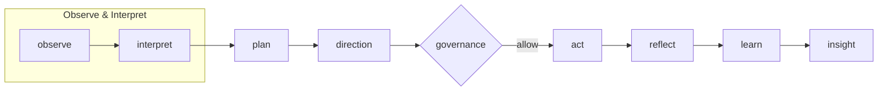

Noēsis drops an explicit cognitive loop on top of any agent stack, so every run is an observable episode context in, actions out with Intuition, Direction, Governance, and Insight captured as immutable artifacts.

<CardGroup cols={2}>
  <Card title="Quickstart" icon="rocket" href="/quickstart">
    Get your first episode running in under 5 minutes.
  </Card>
  <Card title="Core concepts" icon="lightbulb" href="/explanation/core-concepts">
    Understand episodes, phases, faculties, and the cognitive loop.
  </Card>
  <Card title="Python API" icon="code" href="/reference/python-api">
    Explore the full Python API reference.
  </Card>
  <Card title="CLI reference" icon="terminal" href="/reference/cli">
    Run and inspect episodes from the command line.
  </Card>
</CardGroup>

## What Noēsis does

Noēsis sits alongside the graphs, tools, and runtimes you already use. It doesn’t replace your models or orchestrator—it makes their cognition legible.

| Capability | What it gives you |
| --- | --- |
| **Observable cognition** | Each run emits `summary.json`, `state.json`, and `events.jsonl` for replay and evaluation. |
| **Direction + guardrails** | Planner modes (`meta` vs `minimal`) layer planning and governance over any agent graph. |
| **Durable memory** | Plug in SQLite/FAISS/HNSW (or your own provider) so episodes learn across time. |
| **Learning signals** | Insight metrics and `learn.emit(...)` provide structured payloads for audits and tuning. |
## Who it's for

<CardGroup cols={2}>
  <Card title="Builders & platform teams" icon="hammer">
    Wrap LangGraph, CrewAI, or custom graphs with cognition without rewrites.
  </Card>
  <Card title="Applied researchers" icon="flask">
    Collect structured traces for benchmarks, ablations, and papers.
  </Card>
  <Card title="Product & GTM" icon="chart-line">
    Point to concrete KPIs (plan adherence, veto count, tool coverage).
  </Card>
  <Card title="Ops & compliance" icon="shield-check">
    Review immutable JSON traces showing what happened and why it was allowed.
  </Card>
</CardGroup>

## The cognitive loop

Every episode flows through nine phases that make reasoning explicit and auditable:



<Info>
The four Noēsis faculties—**Intuition** (policy), **Direction** (planning), **Governance** (pre-action audit), and **Insight** (evaluation)—work together to make every decision traceable.
</Info>

## Quick example

```python
import noesis as ns

# Run a simple episode
episode_id = ns.run("Draft a weekly engineering update", intuition=True)

# Inspect the results
summary = ns.summary.read(episode_id)
timeline = list(ns.events.read(episode_id))

print(summary["metrics"]["success"])
print(timeline[0]["phase"], timeline[0].get("payload"))
```

Every run produces a clean artifact structure:

```
.noesis/episodes/
  demo/                # label (configurable)
    ep_.../            # episode id
      summary.json     # metrics and outcomes
      state.json       # current plan and episode state
      events.jsonl     # timeline with causal IDs
      manifest.json    # SHA-256 + size ledger for tamper evidence
      learn.jsonl      # optional learning payloads
```

## Next steps

<Steps>
  <Step title="Install Noēsis">
    Install the package and run your first episode in the [quickstart guide](/quickstart).
  </Step>
  <Step title="Understand the concepts">
    Learn about [episodes, faculties, and artifacts](/explanation/core-concepts) in the explanation section.
  </Step>
  <Step title="Add policies">
    Follow the [Governed Side Effects tutorial](/tutorials/governed-side-effects) to add guardrails at the side-effect boundary.
  </Step>
</Steps>
