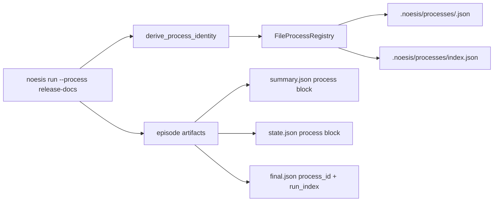

The process registry gives repeated episode runs a stable operator-facing
identity. It is used by `noesis run --process`, `noesis ps --process`,
`noesis processes`, `noesis runs`, `summary.json`, `state.json`, and
`final.json`.

Use it when a workflow runs repeatedly and you want to answer:

- which episode belongs to this named workflow?
- is a long-running workflow still alive?
- what was the latest outcome for this workflow?
- what is the next run number for this workflow?

## Architecture



The runtime derives a deterministic `process_id` from:

- the resolved workspace identity
- the optional `--process` label

If no label is supplied, the display name is auto-derived from the workspace
directory name and the first six characters of the process id.

<Info>
The `process_id` is opaque. Treat the process name as the human handle and the
id as the stable machine key.
</Info>

## Start Grouped Runs

```bash
noesis run "Draft release notes" --process release-docs
noesis run "Publish changelog" --process release-docs
```

Runs with the same resolved workspace and process label share one registry
record. Each allocation increments a per-process `run_index` starting at `1`.
Run index allocation is protected by a process-specific filesystem lock so
concurrent runs receive distinct indexes.

To inspect grouped runs:

```bash
# Recent episodes for one process
noesis ps --process release-docs --limit 10

# Process registry rows
noesis processes --process release-docs --json | jq '.processes[0]'

# Run rows for one process
noesis runs --process release-docs --json | jq '.[0]'
```

`--process` filters accept either the process name or the opaque process id.

## Registry Layout

For the canonical layout, process records live beside episode artifacts:

```text
.noesis/
  episodes/
    ep_.../
      summary.json
      state.json
      final.json
      manifest.json
  processes/
    index.json
    <process_id>.json
    <process_id>.lock
```

`index.json` stores process ids and a name-to-id map. Individual process JSON
files are the source of truth for lifecycle metadata. If the index is missing
or unreadable, the filesystem registry rebuilds it from valid process JSON
records and ignores malformed records.

Legacy process roots are still discovered for reads during layout migration,
but new writes use the canonical `.noesis/processes/` directory.

## Process Record

```json
{
  "schema_version": "process/1.1",
  "process_id": "d3f4a1c9b8e7",
  "process_name": "release-docs",
  "kind": "oneshot",
  "status": "idle",
  "created_at": "2026-05-04T16:00:00Z",
  "last_seen_at": "2026-05-04T16:02:00Z",
  "active_run_id": null,
  "last_run_outcome": "success_unverified",
  "run_index": 2,
  "next_run_index": 3,
  "last_heartbeat_at": "2026-05-04T16:02:00Z",
  "updated_at": "2026-05-04T16:02:00Z"
}
```

<ResponseField name="process_id" type="string" required>
Opaque stable id derived from workspace identity and optional process name.
</ResponseField>

<ResponseField name="process_name" type="string" required>
Human label shown in CLI operator views.
</ResponseField>

<ResponseField name="kind" type="string" required>
Execution style. Current runtime-created records use `oneshot`.
</ResponseField>

<ResponseField name="status" type="string" required>
Stored lifecycle state. CLI liveness can derive `stale` from heartbeat age.
</ResponseField>

<ResponseField name="active_run_id" type="string | null">
Episode id for the active run when one is registered.
</ResponseField>

<ResponseField name="last_run_outcome" type="string | null">
Outcome from the most recent completed run.
</ResponseField>

<ResponseField name="run_index" type="number" required>
Most recently allocated per-process run number.
</ResponseField>

<ResponseField name="next_run_index" type="number" required>
Next run number to allocate. It is always at least `run_index + 1`.
</ResponseField>

<ResponseField name="last_heartbeat_at" type="string" required>
Timestamp used to derive liveness for running records.
</ResponseField>

## Artifact Links

Every terminal episode includes process metadata in the summary and final
artifacts.

`summary.json` carries the operator-facing block:

```json
{
  "process": {
    "id": "d3f4a1c9b8e7",
    "name": "release-docs",
    "kind": "oneshot",
    "run_index": 2
  }
}
```

`state.json` carries the same process block when process metadata is available.
`final.json` stores the process id and run index as part of the sealed terminal
contract.

## Liveness

The runtime starts a daemon heartbeat thread for registered runs. The heartbeat
updates the process record while the run is active. Liveness is derived as:

- `running`: stored status is running and the heartbeat is recent
- `stale`: stored status is running but the heartbeat is older than the stale TTL
- `idle`: the latest run completed and no active run is registered
- `error`: the registry recorded a terminal error status

The stale threshold is `300` seconds. The runtime heartbeat interval is half
that threshold, with a minimum interval of `10` seconds.

<Warning>
Registry updates are operational metadata. Final artifact sealing is the source
of truth for episode completion. If registry finalization fails, the runtime
keeps completing the episode artifacts.
</Warning>

## Troubleshooting

### `noesis processes` does not show a workflow

Cause: the run was started without the expected process label, or the CLI is
reading a different configured Noēsis root.

Fix:

```bash
noesis run "Task" --process release-docs
noesis ps --process release-docs
noesis diagnostics --checks runs_dir
```

Also check `NOESIS_RUNS_DIR` or runtime configuration if you use shared storage.

### A process is `stale`

Cause: the process record still says the run is active, but the heartbeat is
older than the stale threshold.

Fix:

- inspect the `active_run_id` with `noesis processes --json`
- inspect the episode with `noesis view <active_run_id>`
- treat the registry state as best-effort if the terminal artifacts are sealed

### A process name maps to an unexpected id

Cause: process identity includes the resolved workspace identity. The same
`--process` label from different workspace roots produces different ids.

Fix: run process-oriented commands from the same workspace and with the same
configured `NOESIS_RUNS_DIR`, or filter by the explicit process id from
`noesis processes --json`.
