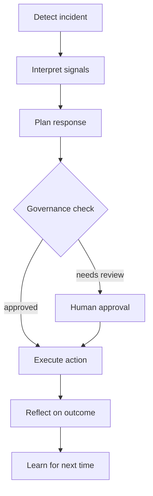

This tutorial walks you through building an incident triage dashboard that showcases Noēsis in a production-minded SRE scenario. You'll implement the full cognitive loop with guardrails, human approvals, and learning proposals.

## What you'll build

A Gradio-based control room that:

- Detects and classifies incidents
- Proposes response actions with governance
- Requires human approval for high-risk operations
- Captures learning signals for future improvement

## Prerequisites

- Completed the [first policy tutorial](/tutorials/first-policy)
- Understanding of the [cognitive loop](/explanation/cognitive-loop)
- Familiarity with Python async patterns (helpful but not required)

## Step 1: Understand the architecture

The incident triage system follows the Noēsis cognitive loop:



| Component | Noēsis concept | Production swap |
| --- | --- | --- |
| Detector | Observe phase | Prometheus/Datadog queries |
| Classifier | Interpret phase | LLM + retrieval |
| Responder | Plan + Act phases | LangGraph plan generator |
| Reviewer | Governance | Slack/ServiceNow approval |
| Policy | Intuition | Your org's guardrails |

## Step 2: Create the policy

Create a policy that enforces your organization's incident response rules:

```python prod_guard.py
import noesis as ns
from noesis.intuition import IntuitionEvent


class IncidentPolicy(ns.DirectedIntuition):
    """Guards incident response actions."""
    
    __version__ = "1.0"
    
    # Risk thresholds
    HIGH_RISK_ACTIONS = {"rollback", "restart", "scale_down", "delete"}
    REQUIRE_APPROVAL = {"rollback", "delete"}
    
    def advise(self, state: dict) -> IntuitionEvent | None:
        action = state.get("proposed_action", "").lower()
        severity = state.get("severity", "low")
        has_canary = state.get("canary_scope", False)
        
        # Hard veto: never allow deletes in production
        if action == "delete" and state.get("environment") == "production":
            return self.veto(
                advice="Blocked: delete operations forbidden in production.",
                target="plan",
                rationale="Production deletes require manual execution with audit trail.",
            )
        
        # Require human approval for high-risk + high-severity
        if action in self.HIGH_RISK_ACTIONS and severity in ("high", "critical"):
            if not has_canary:
                return self.intervene(
                    advice="Requires approval: high-risk action without canary scope.",
                    patch={"requires_approval": True, "scope": "canary_first"},
                    target="plan",
                    rationale="High-severity incidents need canary validation before full rollout.",
                )
        
        # Warn about off-hours changes
        if self._is_off_hours() and action in self.HIGH_RISK_ACTIONS:
            return self.hint(
                advice="Caution: executing high-risk action outside change window.",
                target="plan",
                rationale="Consider waiting for on-call handoff.",
            )
        
        return None
    
    def _is_off_hours(self) -> bool:
        from datetime import datetime
        hour = datetime.now().hour
        return hour < 9 or hour > 18
```

## Step 3: Build the detector

Create a mock detector that simulates incident detection:

```python detector.py
from dataclasses import dataclass
from typing import Literal


@dataclass
class Incident:
    id: str
    title: str
    severity: Literal["low", "medium", "high", "critical"]
    service: str
    signals: dict


def detect_incidents() -> list[Incident]:
    """
    In production, replace with:
    - Prometheus/Alertmanager queries
    - Datadog/New Relic API calls
    - PagerDuty webhook events
    """
    return [
        Incident(
            id="INC-001",
            title="API latency spike in checkout service",
            severity="high",
            service="checkout-api",
            signals={
                "p99_latency_ms": 2500,
                "error_rate": 0.05,
                "affected_users": 1200,
            },
        )
    ]
```

## Step 4: Build the responder

Create a responder that proposes actions:

```python responder.py
from dataclasses import dataclass


@dataclass
class ResponsePlan:
    action: str
    target: str
    parameters: dict
    confidence: float
    rationale: str


def plan_response(incident, state: dict) -> ResponsePlan:
    """
    In production, replace with:
    - LangGraph plan generator
    - Runbook lookup
    - LLM-based reasoning
    """
    # Simple heuristic-based planning
    if incident.signals.get("error_rate", 0) > 0.1:
        return ResponsePlan(
            action="rollback",
            target=incident.service,
            parameters={"to_version": "v1.2.3"},
            confidence=0.85,
            rationale="Error rate exceeds threshold; rollback to last stable version.",
        )
    
    if incident.signals.get("p99_latency_ms", 0) > 2000:
        return ResponsePlan(
            action="scale_up",
            target=incident.service,
            parameters={"replicas": 10},
            confidence=0.75,
            rationale="Latency spike suggests capacity issue; scaling up.",
        )
    
    return ResponsePlan(
        action="monitor",
        target=incident.service,
        parameters={"duration_minutes": 15},
        confidence=0.9,
        rationale="Signals within acceptable range; continuing to monitor.",
    )
```

## Step 5: Wire it together with Noēsis

Create the main orchestration:

```python incident_triage.py
import noesis as ns
from detector import detect_incidents
from responder import plan_response
from prod_guard import IncidentPolicy


def run_triage():
    """Run incident triage with full cognitive loop."""
    
    # Detect incidents
    incidents = detect_incidents()
    
    for incident in incidents:
        # Build initial state
        state = {
            "task": f"Respond to incident: {incident.title}",
            "incident_id": incident.id,
            "severity": incident.severity,
            "service": incident.service,
            "signals": incident.signals,
            "environment": "production",
        }
        
        # Plan the response
        plan = plan_response(incident, state)
        state["proposed_action"] = plan.action
        state["confidence"] = plan.confidence
        
        # Run through Noēsis with policy
        episode_id = ns.run(
            state["task"],
            intuition=IncidentPolicy(),
            tags={
                "incident_id": incident.id,
                "severity": incident.severity,
            },
        )
        
        # Check outcomes
        summary = ns.summary.read(episode_id)
        events = list(ns.events.read(episode_id))
        
        # Find governance decisions
        governance = [e for e in events if e["phase"] == "governance"]
        direction = [e for e in events if e["phase"] == "direction"]
        
        print(f"\nIncident: {incident.id}")
        print(f"  Action: {plan.action}")
        print(f"  Status: {summary['metrics'].get('success', 'unknown')}")
        
        if direction:
            status = direction[-1]["payload"].get("status")
            if status == "blocked":
                print(f"  Blocked: {direction[-1]['payload'].get('advice')}")
            elif "requires_approval" in str(direction[-1].get("payload", {})):
                print("  Awaiting human approval")


if __name__ == "__main__":
    run_triage()
```

## Step 6: Add a Gradio UI (optional)

Create a visual control room:

```python gradio_app.py
import gradio as gr
import noesis as ns
from incident_triage import run_triage


def triage_ui(incident_prompt: str, severity: str, intuition_mode: str):
    """Run triage and return results for display."""
    
    # Configure Noēsis
    ns.set(planner_mode="meta" if intuition_mode == "Full governance" else "minimal")
    
    # Run the episode
    episode_id = ns.run(
        incident_prompt,
        intuition=True,
        tags={"severity": severity, "source": "gradio"},
    )
    
    # Gather results
    summary = ns.summary.read(episode_id)
    events = list(ns.events.read(episode_id))
    
    # Format timeline
    timeline = "\n".join([
        f"[{e['phase']}] {e.get('payload', {}).get('status', 'ok')}"
        for e in events
    ])
    
    # Format metrics
    metrics = summary.get("metrics", {})
    metrics_text = f"""
    Success: {metrics.get('success', 'N/A')}
    Plans: {metrics.get('plan_count', 0)}
    Actions: {metrics.get('act_count', 0)}
    Vetoes: {metrics.get('veto_count', 0)}
    """
    
    return episode_id, timeline, metrics_text


# Build the interface
with gr.Blocks(title="Incident Triage Dashboard") as app:
    gr.Markdown("# 🚨 Incident Triage Dashboard")
    gr.Markdown("Powered by Noēsis cognitive loop")
    
    with gr.Row():
        with gr.Column():
            prompt = gr.Textbox(
                label="Incident description",
                placeholder="API latency spike in checkout service...",
                lines=3,
            )
            severity = gr.Dropdown(
                choices=["low", "medium", "high", "critical"],
                value="medium",
                label="Severity",
            )
            mode = gr.Radio(
                choices=["Full governance", "Minimal (no guardrails)"],
                value="Full governance",
                label="Mode",
            )
            run_btn = gr.Button("Run Triage", variant="primary")
        
        with gr.Column():
            episode_out = gr.Textbox(label="Episode ID")
            timeline_out = gr.Textbox(label="Event Timeline", lines=10)
            metrics_out = gr.Textbox(label="Metrics", lines=6)
    
    run_btn.click(
        triage_ui,
        inputs=[prompt, severity, mode],
        outputs=[episode_out, timeline_out, metrics_out],
    )


if __name__ == "__main__":
    app.launch()
```

Run it:

```bash
pip install gradio
python gradio_app.py
```

## Step 7: Human-in-the-loop approval

When the policy requires approval, you need a way to capture human decisions:

```python approval.py
import noesis as ns


def await_approval(episode_id: str) -> bool:
    """
    In production, replace with:
    - Slack interactive message
    - ServiceNow approval workflow
    - PagerDuty acknowledgment
    """
    # For demo, simulate approval
    print(f"Episode {episode_id} requires approval.")
    response = input("Approve? (y/n): ")
    return response.lower() == "y"


def run_with_approval():
    """Example of human-in-the-loop pattern."""
    
    episode_id = ns.run(
        "Rollback checkout-api to v1.2.3",
        intuition=True,
        tags={"requires_review": True},
    )
    
    # Check if approval is needed
    events = list(ns.events.read(episode_id))
    needs_approval = any(
        "requires_approval" in str(e.get("payload", {}))
        for e in events
    )
    
    if needs_approval:
        approved = await_approval(episode_id)
        if approved:
            # Re-run with approval flag
            episode_id = ns.run(
                "Rollback checkout-api to v1.2.3 [APPROVED]",
                intuition=True,
                tags={"approved": True},
            )
    
    return episode_id
```

## What you've built

<Check>
You now have a complete incident triage system with:
- Incident detection and classification
- Policy-based guardrails
- Human approval workflows
- Full observability through Noēsis artifacts
</Check>

## Artifacts produced

Every triage run produces:

| File | Contents |
| --- | --- |
| `events.jsonl` | Full timeline with phases, agent IDs, advice, status |
| `summary.json` | Success metrics, latencies, learn proposal counts |
| `state.json` | Current plan state and cognitive context |
| `learn.jsonl` | Learning signals for policy improvement |

## Production considerations

<Warning>
The mocks in this tutorial are deterministic for demo purposes. For production:

- Replace `detect_incidents()` with real monitoring integrations
- Replace `plan_response()` with LLM-based planning (LangGraph, etc.)
- Replace approval simulation with Slack/ServiceNow workflows
- Add authentication and audit logging
</Warning>

## Next steps

<CardGroup cols={2}>
  <Card title="Human-in-the-loop guide" icon="user-check" href="/guides/human-in-the-loop">
    Deep dive into approval patterns.
  </Card>
  <Card title="Export metrics guide" icon="chart-bar" href="/guides/export-metrics">
    Send Noēsis metrics to your observability stack.
  </Card>
</CardGroup>
